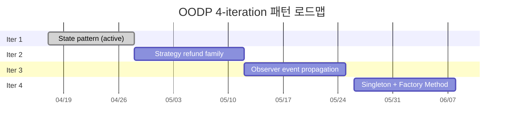
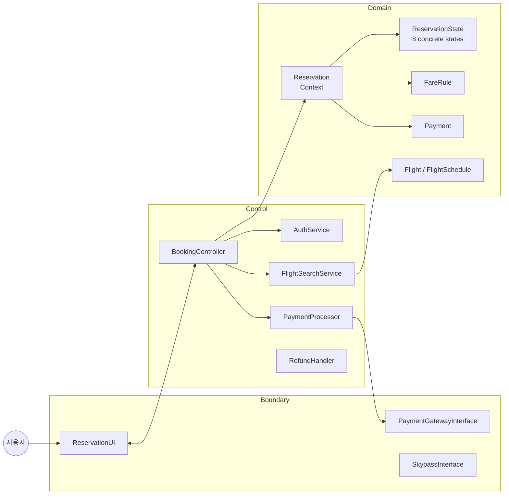
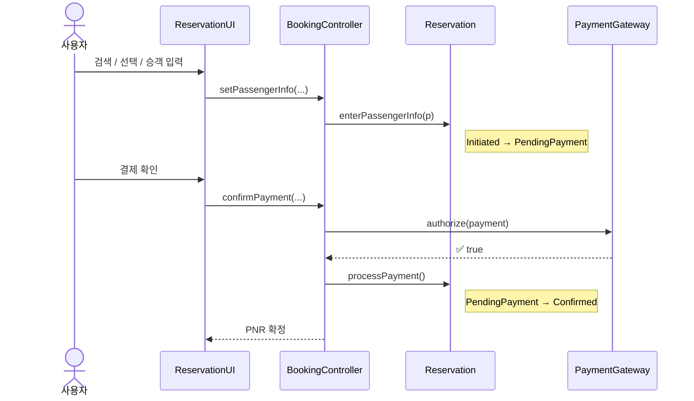
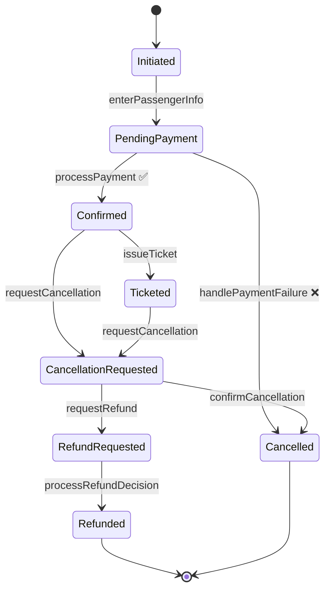

<div align="center">

# ✈️ 대한항공 Skypass 티켓 예약 시스템

**한동대학교 · ECE312 객체지향 설계패턴 · 2026년 1학기 · 설계프로젝트 #2 · A팀**

[](https://openjdk.org/)
[-1E90FF?style=flat-square)](https://openjfx.io/)
[](https://maven.apache.org/)
[](#-디자인-패턴-9종--ui-시연-위치)
[](#-진행-상태)
[](#%EF%B8%8F-라이선스-및-학술-무결성)

</div>

---

설계프로젝트 #1에서 만든 UML 모델을 자바 데스크톱 애플리케이션으로 구현하고, 4번의 iteration을 거치며 점진적으로 정제해 나가는 프로젝트. 각 iteration은 하나의 주축 디자인 패턴을 중심에 둔다. UI 는 **JavaFX(FXML + CSS)** 로 구현했고, Control/Domain 계층의 **9개 GoF 디자인 패턴이 모두 화면에서 실제로 동작**한다.

> [!NOTE]
> Boundary(UI)만 JavaFX 로 교체했을 뿐, Control/Domain 인프라와 9개 디자인 패턴은 그대로다. 9개 패턴(State, Strategy, Observer, Composite, Singleton, Factory Method, Template Method, Adapter, Decorator)이 각각 어느 화면에서 시연되는지는 [디자인 패턴 9종 표](#-디자인-패턴-9종--ui-시연-위치) 참조. 각 iteration 보고서는 [`docs/iteration-reports/`](docs/iteration-reports/).

---

## 📌 진행 상태

| Iteration | 주축 패턴 | 상태 | 다루는 기능 |
| :---: | :--- | :---: | :--- |
| **1** | **State** — 8개 구상 상태 클래스 | ✅ 동작 | 로그인, 검색, 직항, 승객, 결제 |
| **2** | **Strategy** — `RefundPolicy` family | ✅ 동작 | 취소, 환불, e-Ticket, 예약 조회, 좌석 선택, salted-hash auth |
| **3** | **Observer** — 이벤트 전파 | ✅ 동작 | 환승, multi-city, 마일리지, 셔틀 연계 발권, 자동 취소 |
| **4** | **Singleton, Factory Method, Template Method, Adapter, Decorator, Composite** | ✅ 동작 | 전역 설정, 결제수단 라우팅, e-Ticket 렌더, Skypass 연동, 좌석 부가옵션, 도시 검색, 환불 검토, 회원가입 |

> 9개 패턴 모두 JavaFX UI 에서 실제로 호출/동작한다 (아래 표 참조).

### 패턴 로드맵



---

## 🎯 디자인 패턴 9종 — UI 시연 위치

9개 GoF 패턴이 모두 JavaFX 화면에서 실제로 호출되어 동작한다. 각 패턴이 어느 화면에서 보이는지:

| # | 패턴 | 분류 | UI 시연 위치 | 핵심 클래스 |
| :-: | :-- | :-- | :-- | :-- |
| 1 | **State** | 행위 | 헤더 상태 배지 — 예약 진행에 따라 `PendingPayment → Confirmed → Ticketed → Refunded` 실시간 표시 | `ReservationState` + 8개 구상 상태 |
| 2 | **Strategy** | 행위 | 취소 화면 환불 미리보기, 환불 검토 대기열 | `RefundPolicy` (Full/Partial/No) |
| 3 | **Observer** | 행위 | 결제/확인 화면의 셔틀버스 연계 발권 (e-Ticket 발권 → 버스티켓 자동 발매) | `TicketPurchasePublisher` + Listener |
| 4 | **Composite** | 구조 | 검색에서 도시 코드(`SEL`/`TYO`/`NYC`/`LON`) 입력 시 소속 공항 전체 검색 | `AirportLocation`/`AirportCity`/`Airport` |
| 5 | **Singleton** | 생성 | 헤더 **설정** → 글꼴/통화/테마/좌석 메타데이터 (즉시 반영) | `AppConfig` (double-checked locking) |
| 6 | **Factory Method** | 생성 | 결제 화면 결제수단 선택(카드/카카오페이/애플페이/계좌이체/마일리지), 환승 검색 | `PaymentProcessorFactory`, `ItineraryFactory` |
| 7 | **Template Method** | 행위 | 확인 화면 e-Ticket 포맷 토글(일반/HTML/보딩패스) | `TicketRenderer` + 3개 구상 |
| 8 | **Adapter** | 구조 | 결제 화면 마일리지 잔액 표시 + 마일리지 결제 (외부 Skypass API) | `SkypassAdapter` + `RemoteSkypassApi` |
| 9 | **Decorator** | 구조 | 좌석 화면 — 창측/통로 자동 표시 + 레그룸/라운지 업그레이드 누적 부가요금 | `SeatView` + Window/Aisle/ExtraLegroom/Lounge |

## 🖥 화면 구성

`app.fx.screen` 의 컨트롤러 + 각 `*.fxml`:

```
랜딩(검색)  — 히어로 + 인기 여행지 카드 + 편도/왕복/다구간 + 환승 포함 + 도시 검색
로그인 / 회원가입 — Skypass 로그인, 비회원 둘러보기, 신규 가입(번호 자동 발급)
승객정보 → 좌석(Decorator 부가옵션) → 결제(Factory 결제수단 · Adapter 마일리지) → 확인(Template e-Ticket · Observer 셔틀)
예약 조회 — 회원 예약 목록 / 비회원 PNR 조회 (상태별 진행/취소 버튼)
취소·환불 → 환불 완료 / 환불 검토 대기열(담당자 승인·거절)
설정 — 전역 환경설정(Singleton)
```

## 🏛 아키텍처 (ECB)



<details>
<summary>📁 <b>패키지 구조 펼쳐보기</b></summary>

```
src/com/koreanair/reservation/
├── app/                    # 진입점(App 콘솔, FxApp), 목 인프라, 샘플 데이터
│   └── fx/                 # JavaFX UI — Navigator, ShellController, *.fxml, app.css
│       └── screen/         # 화면별 Controller (Login, Search, Passenger, Seat, Payment, ...)
├── boundary/               # ReservationUI, PaymentGatewayInterface, SkypassInterface
├── control/                # BookingController, AuthService, FlightSearchService,
│                           # PaymentProcessor, RefundHandler
├── domain/
│   ├── reservation/        # Reservation 애그리거트 (State 패턴의 Context)
│   │   └── state/          # 8개 *State + AbstractReservationState
│   │                       # + InvalidStateTransitionException
│   ├── flight/             # Flight, FlightSchedule, FareRule, Seat, SeatInventory, ...
│   ├── passenger/          # Passenger, MileageAccount (iter3), PassengerType
│   ├── payment/            # Payment, PaymentMethod, Refund (iter2), RefundRequest (iter2)
│   └── user/               # User, Member, Admin, GuestBookingRequester
└── tools/                  # AmaterasUML 에미터 (Generate*Diagram.java)
```

총 **114개 자바 파일**, **18개 패키지**.

</details>

---

## 🚶 Walking Skeleton (iteration 1)

iteration 1의 happy path는 `App.main(...)`에서 끝까지 동작합니다.



콘솔에서는 두 줄이 출력되어 State 전이를 직접 확인할 수 있습니다.

```
[STATE] Initiated -> PendingPayment
[STATE] PendingPayment -> Confirmed
```

UI 는 **JavaFX(`app.fx.FxApp`)** 로 구현되어 있으며, Control 과 Domain 코드를 그대로 사용하면서 동일한 시나리오를 구동합니다. 화면 레이아웃은 FXML, 스타일은 CSS, 로직은 Controller 로 분리됩니다. 처음에는 Swing 으로 시작했으나 선언형 FXML + CSS 구조로 전환했습니다 — Control/Domain 을 한 줄도 건드리지 않고 Boundary 만 교체했다는 점이 **ECB 아키텍처의 비파괴적 경계 교체**를 그대로 증명합니다.

### State 패턴 전이도



> [!NOTE]
> Iteration 1에서는 **3개 전이만 실제로 동작**합니다 (`enterPassengerInfo`, `processPayment` 성공, `handlePaymentFailure`). 나머지 전이는 8개 `*State` 클래스에 선언만 되어 있으며, iteration 2부터 본문이 채워집니다.

---

## 🛠 빌드 및 실행

UI 는 **JavaFX(FXML + CSS)** 로 구현되어 있고, 의존성 관리는 **Maven** 으로 합니다. Maven Wrapper(`mvnw`)가 포함되어 있어 별도 설치 없이 바로 실행됩니다.

### A) JavaFX UI (권장)

```bash
./mvnw javafx:run          # macOS / Linux
mvnw.cmd javafx:run        # Windows
```

> JavaFX 23 의존성은 첫 실행 시 Maven 이 자동으로 내려받습니다. `tools/`(AmaterasUML 에미터)는 Eclipse 플러그인 jar 에 의존하므로 Maven 빌드에서 제외됩니다.

### B) 콘솔 드라이버

```bash
./mvnw -q compile
java -cp target/classes com.koreanair.reservation.app.App
```

### C) Eclipse

```
File → Import → Existing Maven Projects → clone한 디렉토리 선택
```

진입점:

| 모드 | 클래스 |
| --- | --- |
| JavaFX UI | `com.koreanair.reservation.app.fx.FxApp` |
| 콘솔 | `com.koreanair.reservation.app.App` |

---

## 🎨 다이어그램 자동 생성

UML 다이어그램 4종(use case · class · sequence · state)은 `com.koreanair.reservation.tools` 패키지의 에미터 클래스가 소스 트리에서 자동 생성합니다.

| 에미터 | 출력 파일 |
| --- | --- |
| `GenerateUseCaseDiagram` | `reservationSystem.ucd` |
| `GenerateClassDiagram` | `classDiagram.cld` |
| `GenerateSequenceDiagrams` | `bookFlight.sqd` · `adminOperations.sqd` · `memberBookingTicket.sqd` |
| `GenerateStateDiagrams` | `reservationState.acd` · `seatState.acd` · `flightScheduleState.acd` |

각 에미터는 워크스페이스에 AmaterasUML XML 파일을 쓰며, Eclipse에서 AmaterasUML 플러그인으로 열어 PNG로 export하면 됩니다.

> [!TIP]
> 다이어그램을 손으로 그리지 않고 소스에서 자동 생성하는 이유: iteration이 진행되며 설계가 바뀌어도 한 번의 rebuild로 모든 다이어그램이 자동 동기화됩니다 — **"그림 그리기"보다 "문서 컴파일"에 가깝습니다.**

---

## 📄 제출물

iteration별 보고서는 [`docs/iteration-reports/`](docs/iteration-reports/) 아래에 보관합니다.

| Iteration | 패턴 | 한국어 | 영문 |
| :---: | :--- | :---: | :---: |
| **1** | State (Walking Skeleton) | [📄 KO](docs/iteration-reports/iteration-1-ko.md) | [📄 EN](docs/iteration-reports/iteration-1-en.md) |
| **2** | Strategy (`RefundPolicy` family) | [📄 KO](docs/iteration-reports/iteration-2-ko.md) | — |

---

## 👥 A팀

<table>
<tr>
<td align="center" width="33%">
<b>김정욱</b><br>
<sub>Jungwook Kim</sub><br><br>
🧱 <b>도메인 & 패턴</b>
</td>
<td align="center" width="33%">
<b>이재호</b><br>
<sub>Jaeho Lee</sub><br><br>
🖼 <b>Boundary</b>
</td>
<td align="center" width="33%">
<b>김경동</b><br>
<sub>Gyungdong Kim</sub><br><br>
⚙️ <b>Control & 어댑터</b>
</td>
</tr>
<tr>
<td valign="top">
<sub>
• <code>Reservation</code> 애그리거트<br>
• 9개 GoF 디자인 패턴<br>
• AmaterasUML 에미터<br>
• 통합
</sub>
</td>
<td valign="top">
<sub>
• JavaFX UI (FXML + CSS)<br>
• 콘솔 프런트엔드<br>
• <code>ReservationUI</code> 구현
</sub>
</td>
<td valign="top">
<sub>
• <code>PaymentProcessor</code><br>
• <code>RefundHandler</code><br>
• <code>PaymentGatewayInterface</code> 목 구현<br>
• <code>AuthService</code><br>
• JUnit 스위트
</sub>
</td>
</tr>
</table>

---

## ⚖️ 라이선스 및 학술 무결성

> [!IMPORTANT]
> 본 저장소는 **학술·참고 목적**으로 공개됩니다. 다른 학기·다른 기관의 OODP 제출에 그대로 재사용하는 것은 학술적 부정행위에 해당하며 허용되지 않습니다.

---

<div align="center">
<sub>Made with ☕ and the Gang-of-Four book · Spring 2026</sub>
</div>
