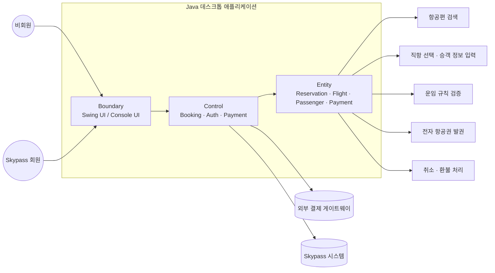
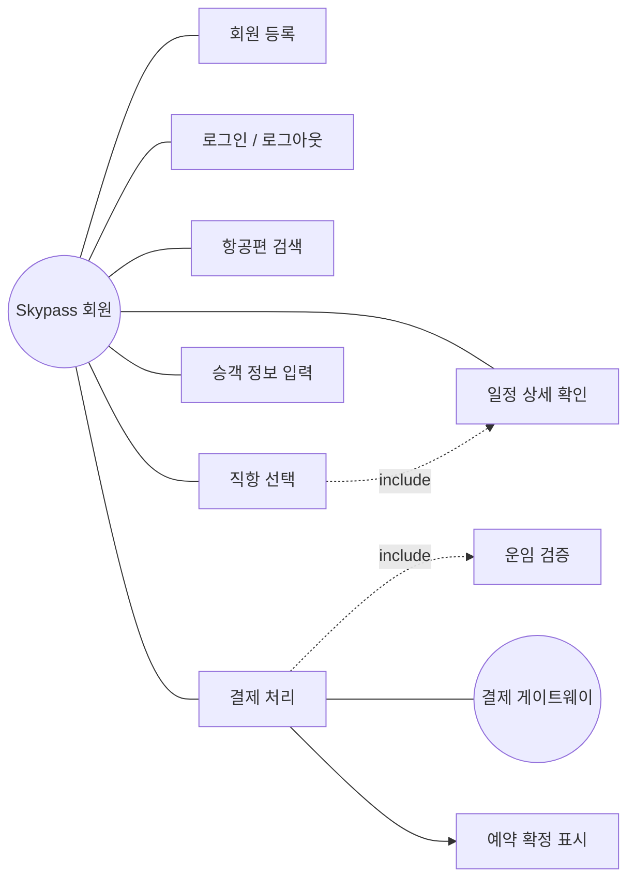
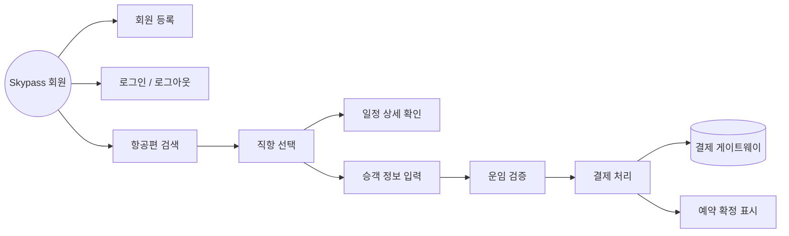
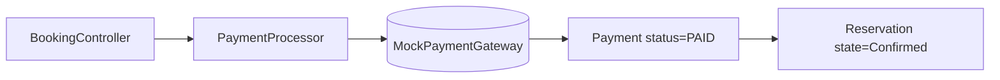
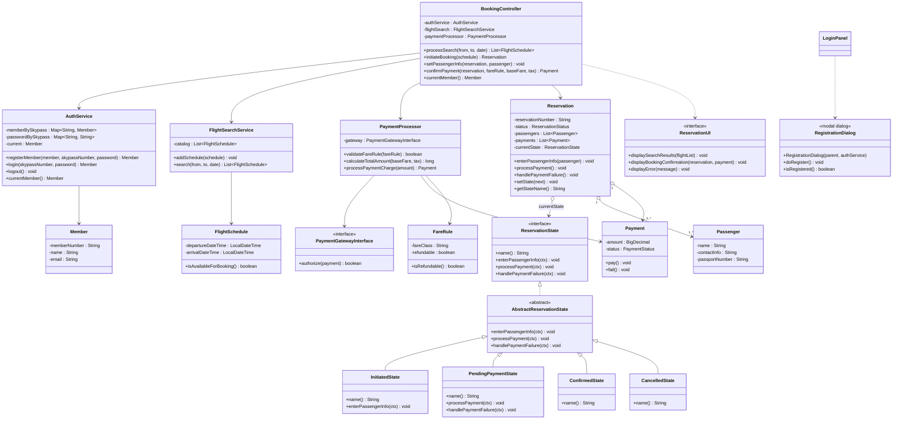
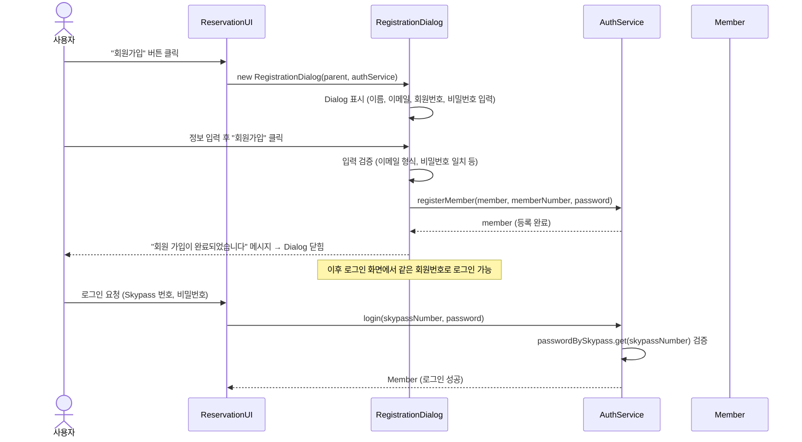
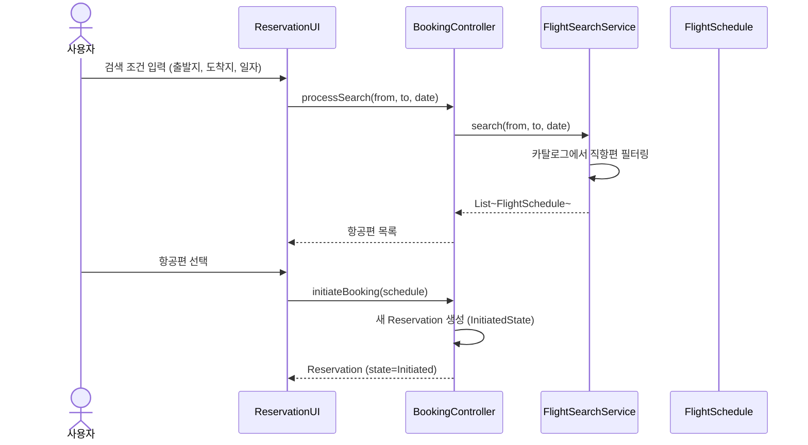
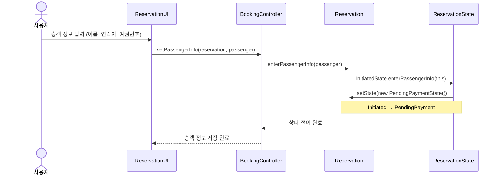
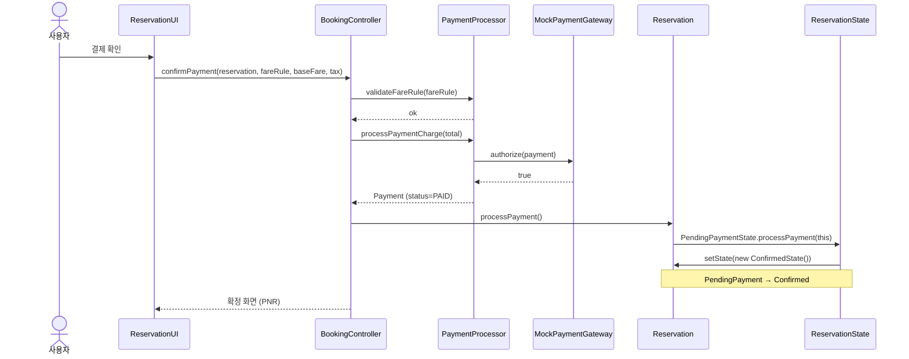
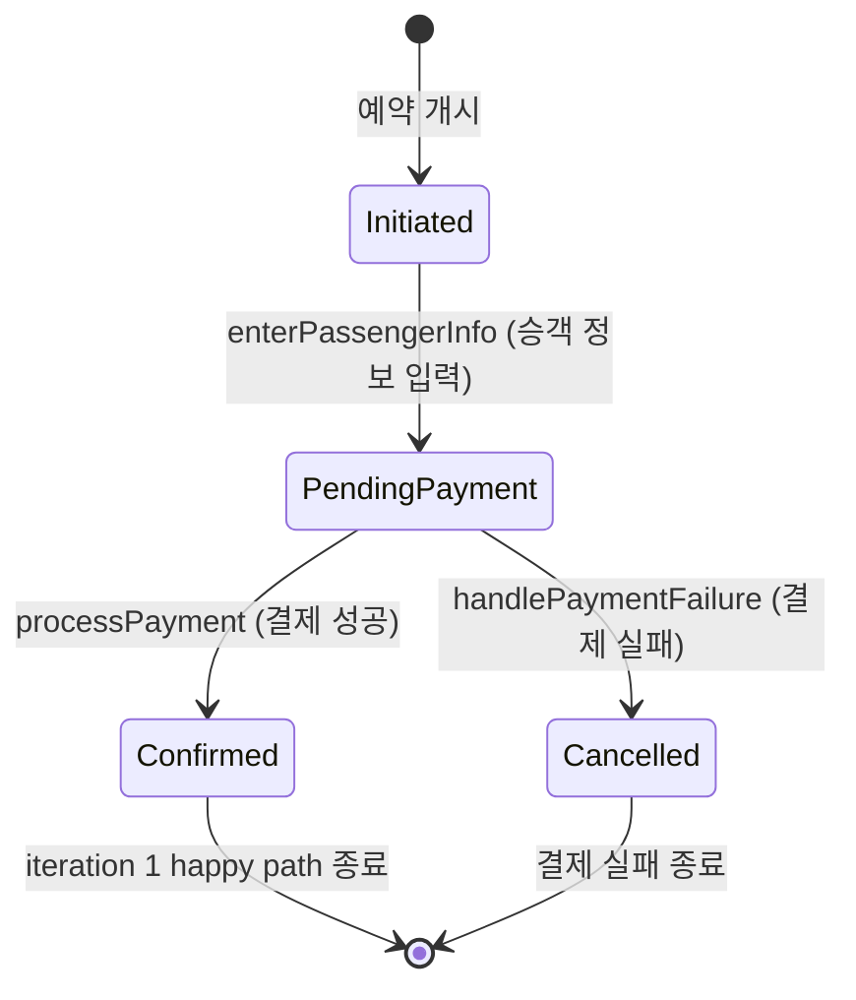

<div align="center">

# ✈️ <span style="color:red">Iteration 1 — Feature Inventory & Walking Skeleton (State 패턴)</span>

### <span style="color:red">대한항공 Skypass 티켓 예약 시스템</span>

[](https://github.com/gimjungwook/KoreanAirReservationDomain)
[](#-6-iteration-1-구현-신규-추가)
[](#-3-design-pattern-roadmap)
[](https://github.com/gimjungwook/KoreanAirReservationDomain)

[**🇬🇧 English version**](iteration-1-en.md) · [**➡ Iteration 2 (Strategy)**](iteration-2-ko.md) · [**📂 Source code**](https://github.com/gimjungwook/KoreanAirReservationDomain)

</div>

> [!IMPORTANT]
> ### 📣 지난주 → 이번주
> **지난주에 Proposal #0 초안을 보여드렸는데, 다시 보니 빠진 부분이 많아서 모두 채워 넣었습니다.** 빨간색이 새로 채운 부분이고, 본 발표는 그 변화를 중심으로 진행됩니다.

### 🗺 발표 흐름

| 단계 | 발표 내용 | 본문 위치 |
| :---: | :--- | :---: |
| **1** | 🩹 지난주 outline에서 빠뜨렸던 부분을 어떻게 채웠는지 | [1번](#-1-시스템과-팀) · [5번](#-5-uml-다이어그램-신규-추가) |
| **2** | 🚀 Iteration 1 walking skeleton 시연 | [6번](#-6-iteration-1-구현-신규-추가) |
| **3** | 🔮 Iteration 2에서 무엇을 구현할지 | [6.6번](#-66-다음-iteration-개요) |

### 🩹 새로 채운 부분 한눈에

| | 섹션 | 채운 내용 |
| :---: | :--- | :--- |
| ✨ | **1번 시스템과 팀** | 시스템 범위 · 사용자 유형 · Java 데스크톱 앱 구조 · ECB 계층별 팀 분담 |
| ✏️ | **2번 Feature Inventory** | 전체 기능 목록 기준표와 iteration 번호 제시 |
| 💡 | **3번 Design Pattern Roadmap** | iteration별 inventory와 각 패턴의 채택 근거를 함께 설명 |
| 🎨 | **5번 UML 4종** | Use Case · Class (속성·연산 풀) · Sequence · State (Mermaid 자동 생성) |
| 🚀 | **6번 Iteration 1 구현** | Walking Skeleton 8단계 · 11개 패키지 · State 패턴 3단 위임 구조 · 핵심 클래스 표 · 의도적 한계 4건 |
| 🔮 | **6.6번 Iteration 2-4 개요** | Strategy / Observer / Singleton + Factory Method 구현 계획 한 문단 |

---

| <span style="color:red">항목</span> | <span style="color:red">내용</span> |
| --- | --- |
| <span style="color:red">과목</span> | <span style="color:red">ECE312 객체지향 설계패턴 (2026년 1학기)</span> |
| <span style="color:red">제출물</span> | <span style="color:red">Proposal#0 — 7주차 (마감 2026-04-16, 18:00 KST)</span> |
| <span style="color:red">팀</span> | <span style="color:red">A팀 — 김정욱, 이재호, 김경동</span> |
| <span style="color:red">소스 베이스라인</span> | <span style="color:red">`KoreanAirReservationDomain` (Eclipse 자바 프로젝트, 자바 소스 78개)</span> |

> - <span style="color:red">**색상 규칙.** 검정은 원래 Proposal#0 outline에서 그대로 가져온 내용이다.</span>
> - <span style="color:red">빨간색은 본 제출본에서 outline에 새로 추가된 모든 섹션·단락·표·주석을 표시한다.</span>

---

## <span style="color:red">📌 0. 실행 방법 및 시연</span>

### <span style="color:red">0.1 컴파일</span>

```bash
cd KoreanAirReservationDomain
javac -sourcepath src -d bin $(find src -name "*.java" | grep -v "tools/")
```

### <span style="color:red">0.2 실행</span>

```bash
cd KoreanAirReservationDomain
java -cp bin com.koreanair.reservation.app.swing.SwingApp
```

---

## <span style="color:red">📌 1. 시스템과 팀</span>

### <span style="color:red">1.1 시스템</span>

- <span style="color:red">본 제안은 **대한항공 Skypass 티켓 예약 시스템**을 대상으로 한다.</span>
- <span style="color:red">설계프로젝트 #1에서 만든 UML 모델을 Java 데스크톱 애플리케이션으로 구현한다.</span>
- <span style="color:red">4번의 iteration을 통해 점진적으로 정제한다.</span>




- <span style="color:red">사용자는 비회원과 Skypass 회원으로 나뉜다.</span>
- <span style="color:red">핵심 도메인은 항공편 검색, 예약 진행, 운임 검증, 결제, 발권, 취소·환불로 이어지는 항공권 예약 생애주기다.</span>


### <span style="color:red">1.2 A팀 (3명)</span>

- <span style="color:red">A팀은 현재 3인 체제로 운영 중이다.</span>
- <span style="color:red">작업 분담은 use case별로 나누지 않는다.</span>
- <span style="color:red">use case별 분담은 매 iteration마다 익숙치 않은 코드를 다시 학습하게 만들기 때문에 비효율적이다.</span>
- <span style="color:red">대신 ECB 계층별로 나누어 각 팀원이 프로젝트 전체 생애주기 동안 한 가지 횡단 관심사를 일관되게 책임진다.</span>

| <span style="color:red">팀원</span> | <span style="color:red">담당 계층</span> | <span style="color:red">구체 책임 (전 iteration 공통)</span> |
| --- | --- | --- |
| <span style="color:red">김정욱</span> | <span style="color:red">도메인 & 패턴</span> | <span style="color:red">1. `Reservation` 도메인 모델<br/>2. State 패턴 (iter1)<br/>3. Strategy 환불 family (iter2)<br/>4. Observer (iter3)<br/>5. Singleton + Factory Method (iter4)<br/>6. AmaterasUML 에미터 클래스<br/>7. 통합</span> |
| <span style="color:red">이재호</span> | <span style="color:red">Boundary</span> | <span style="color:red">1. Swing UI 패널 (`MainFrame`, `LoginPanel`, `SearchPanel`, `PassengerPanel`, `PaymentPanel`, `ConfirmationPanel`, `StateBadge`)<br/>2. `ConsoleReservationUI` 콘솔 프런트엔드</span> |
| <span style="color:red">김경동</span> | <span style="color:red">Control & 어댑터</span> | <span style="color:red">1. `PaymentProcessor`<br/>2. `RefundHandler`<br/>3. `PaymentGatewayInterface` 목 구현<br/>4. `AuthService`<br/>5. 4 iteration 전체를 보호하는 JUnit 스위트</span> |

- <span style="color:red">계층 단위 분담의 효과는 iteration 경계에서 가장 잘 드러난다.</span>
- <span style="color:red">iteration 2에서 Strategy 패턴을 도입할 때 변경은 도메인 계층(김정욱)과 control 계층(김경동)에 한정된다.</span>
- <span style="color:red">Boundary 계층(이재호)은 손댈 필요가 없다.</span>
- <span style="color:red">iteration 1에서 콘솔 UI를 Swing UI로 교체할 때도 이재호가 자신의 파일만 수정하면 됐다.</span>
- <span style="color:red">학생 팀 프로젝트에서 자주 발생하는 같은 파일 동시 수정 문제를 계층 단위 분담으로 줄인다.</span>

- <span style="color:red">이재호·김경동의 영문 표기는 본인 선호 표기 확정 전 placeholder다.</span>

---

## 📊 2. Feature Inventory (Form #1)

- 기능은 두 단계 계층(Category > Sub-feature)으로 정리된다.
- 각 sub-feature에는 주로 어느 iteration(1 / 2 / 3 / 4)에 구현될지 표기한다.
- 이후 iteration에서도 리팩토링과 패턴 적용을 통해 계속 다듬어진다.

> - <span style="color:red">**헤더 라벨 변경.** 아래 표 3번째 컬럼을 `i`에서 `구현 iteration (1 / 2 / 3 / 4)`로 풀어 표기한다.</span>
> - <span style="color:red">목적은 인쇄본에서 의미 모호성을 제거하는 것이다.</span>
> - <span style="color:red">행 데이터는 변경하지 않는다.</span>

### <span style="color:red">2.1 전체 Feature Inventory</span>

- <span style="color:red">먼저 전체 기능 목록을 한 번에 보여준다.</span>
- <span style="color:red">이 표의 목적은 시스템 범위를 빠짐없이 보여주는 것이다.</span>
- <span style="color:red">세 번째 컬럼의 iteration 번호는 뒤에서 필터링할 기준값으로 사용한다.</span>

| Category | Sub-feature | <span style="color:red">구현 iteration (1 / 2 / 3 / 4)</span> |
| --- | --- | --- |
| Authentication | Member registration | 1 |
|  | Login / Logout (Skypass 회원) | 1 |
|  | Member profile and mileage balance lookup | 2 |
|  | Guest verification (PNR + name + email triple check) | 2 |
| Flight Search and Selection | Flight search (origin, destination, date, pax, trip type) | 1 |
|  | Itinerary detail display (fare rule, seat info, fees) | 1 |
|  | Direct-flight selection | 1 |
|  | Connecting-flight selection with layover validation | 3 |
|  | Multi-city itinerary composition | 3 |
| Booking Flow | Passenger info entry (name, contact, passport) | 1 |
|  | Seat selection (aircraft-specific seat map) | 2 |
|  | 15-minute seat hold management | 3 |
|  | Mileage application (members only) | 3 |
|  | Fare validation (FareRule-based calculation) | 1 |
|  | Payment processing (Payment Gateway integration) | 1 |
|  | Auto-cancel on payment failure | 3 |
| Mileage | Mileage balance lookup (members only) | 3 |
|  | Partial or full mileage redemption | 3 |
|  | Real-time Skypass System verification | 3 |
| Reservation Lookup | Member reservation lookup | 2 |
|  | Guest reservation lookup (after verification) | 2 |
| Cancellation and Refund | Cancellation request intake (Confirmed / Ticketed only) | 2 |
|  | Fare-rule-based refundability check | 2 |
|  | Refund policy selection (Strategy pattern) | 2 |
|  | Automatic refund processing (FareRule-driven) | 2 |
|  | Exceptional refund admin review | 4 |
|  | Refund disbursement (Payment Gateway) | 2 |
| Connecting and Multi-city | Through-check-in for baggage on connections | 3 |
|  | Independent fare calculation per segment (multi-city) | 3 |
| e-Ticket | e-Ticket issuance (PNR generation) | 2 |
|  | e-Ticket PDF download | 4 |
|  | Real-time reservation status tracking | 4 |
| Options and Settings | Font family and size change | 4 |
|  | Language and currency unit change | 4 |

### <span style="color:red">2.2 Inventory 읽는 방식</span>

- <span style="color:red">이 표는 전체 시스템 범위를 먼저 보여주기 위한 기준표다.</span>
- <span style="color:red">세 번째 컬럼의 iteration 번호를 기준으로 기능을 필터링한다.</span>
- <span style="color:red">다음 Design Pattern Roadmap에서 각 iteration inventory와 적용 패턴을 함께 설명한다.</span>

---

## 🎯 Design Pattern Roadmap (minimum 3, maximum 7)

- 설계프로젝트 #1 최종 보고서에 이미 반영된 State, Strategy가 iteration 1·2의 주축이다.
- iteration 3과 4에서 Observer와 Singleton을 추가하여 총 4개를 목표로 한다.
- iteration 4에서 Factory Method를 도입하여 5개로 확장하는 옵션도 열어둔다.
- 본 과목은 패턴 개수보다 "왜 이 맥락에 이 패턴이 적합한가"를 평가하므로, 아래에서는 각 iteration의 inventory와 패턴 채택 근거를 함께 설명한다.

### <span style="color:red">3.1 Iteration 1 - State 패턴</span>

| <span style="color:red">Category</span> | <span style="color:red">Sub-feature</span> | <span style="color:red">발표 포인트</span> |
| --- | --- | --- |
| <span style="color:red">Authentication</span> | <span style="color:red">Member registration</span> | <span style="color:red">`RegistrationDialog`로 새 회원 가입 → `AuthService.registerMember()`로 저장.</span> |
| <span style="color:red">Authentication</span> | <span style="color:red">Login / Logout (Skypass 회원)</span> | <span style="color:red">사용자를 식별하고 예약 진행 주체를 확정한다.</span> |
| <span style="color:red">Flight Search and Selection</span> | <span style="color:red">Flight search</span> | <span style="color:red">예약 happy path의 첫 Boundary-Control 연결이다.</span> |
| <span style="color:red">Flight Search and Selection</span> | <span style="color:red">Itinerary detail display</span> | <span style="color:red">선택한 항공편의 운임·좌석·수수료 정보를 확인한다.</span> |
| <span style="color:red">Flight Search and Selection</span> | <span style="color:red">Direct-flight selection</span> | <span style="color:red">iteration 1은 가장 단순한 직항 예약만 대상으로 한다.</span> |
| <span style="color:red">Booking Flow</span> | <span style="color:red">Passenger info entry</span> | <span style="color:red">`Initiated → PendingPayment` State 전이를 발생시킨다.</span> |
| <span style="color:red">Booking Flow</span> | <span style="color:red">Fare validation</span> | <span style="color:red">결제 전 운임 규칙을 검증한다.</span> |
| <span style="color:red">Booking Flow</span> | <span style="color:red">Payment processing</span> | <span style="color:red">`PendingPayment → Confirmed` State 전이를 발생시킨다.</span> |

- <span style="color:red">Iteration 1은 전체 시스템을 얇게 한 번 관통하는 walking skeleton이다.</span>
- <span style="color:red">회원 등록과 로그인으로 사용자를 만들고, 검색 → 직항 선택 → 승객 정보 입력 → 운임 검증 → 결제까지 최소 예약 흐름을 구현한다.</span>
- <span style="color:red">핵심은 8개 기능을 얇지만 실제로 연결하고, 그 과정에서 `Reservation` 생애주기가 State 패턴으로 움직인다는 점이다.</span>
- <span style="color:red">State 패턴 없이 구현하면 `ReservationStatus` enum 기반 if/else 사슬이 길어지고, 상태 추가 때마다 여러 메서드를 함께 고쳐야 한다.</span>
- <span style="color:red">State 패턴을 적용하면 생애주기 이벤트가 현재 상태 객체에 대한 다형 호출이 되고, 새 상태 추가는 새 클래스 작성으로 끝난다.</span>

### <span style="color:red">3.2 Iteration 2 - Strategy 패턴</span>

| <span style="color:red">Category</span> | <span style="color:red">Sub-feature</span> | <span style="color:red">발표 포인트</span> |
| --- | --- | --- |
| <span style="color:red">Authentication</span> | <span style="color:red">Member profile and mileage balance lookup</span> | <span style="color:red">로그인 이후 회원 정보 조회 범위를 넓힌다.</span> |
| <span style="color:red">Authentication</span> | <span style="color:red">Guest verification</span> | <span style="color:red">비회원도 PNR + 이름 + 이메일로 예약을 조회할 수 있게 한다.</span> |
| <span style="color:red">Booking Flow</span> | <span style="color:red">Seat selection</span> | <span style="color:red">예약 확정 전에 좌석 선택 단계를 추가한다.</span> |
| <span style="color:red">Reservation Lookup</span> | <span style="color:red">Member reservation lookup</span> | <span style="color:red">회원의 예약 이력을 조회한다.</span> |
| <span style="color:red">Reservation Lookup</span> | <span style="color:red">Guest reservation lookup</span> | <span style="color:red">검증된 비회원의 단건 예약 조회를 지원한다.</span> |
| <span style="color:red">Cancellation and Refund</span> | <span style="color:red">Cancellation request intake</span> | <span style="color:red">Confirmed / Ticketed 상태에서만 취소 요청을 받는다.</span> |
| <span style="color:red">Cancellation and Refund</span> | <span style="color:red">Fare-rule-based refundability check</span> | <span style="color:red">운임 규칙에 따라 환불 가능 여부를 판단한다.</span> |
| <span style="color:red">Cancellation and Refund</span> | <span style="color:red">Refund policy selection</span> | <span style="color:red">Strategy 패턴으로 환불 정책을 선택한다.</span> |
| <span style="color:red">Cancellation and Refund</span> | <span style="color:red">Automatic refund processing</span> | <span style="color:red">선택된 Strategy로 환불 금액과 처리를 계산한다.</span> |
| <span style="color:red">Cancellation and Refund</span> | <span style="color:red">Refund disbursement</span> | <span style="color:red">결제 게이트웨이를 통해 환불 지급을 연결한다.</span> |
| <span style="color:red">e-Ticket</span> | <span style="color:red">e-Ticket issuance</span> | <span style="color:red">PNR 생성과 발권 상태를 연결한다.</span> |

- <span style="color:red">Iteration 2는 iteration 1에서 만들어진 예약을 조회, 발권, 취소, 환불 가능한 대상으로 확장한다.</span>
- <span style="color:red">회원과 비회원 모두 예약을 찾을 수 있어야 하므로 예약 조회 기능이 먼저 들어간다.</span>
- <span style="color:red">Confirmed / Ticketed 상태의 예약에 대해서만 취소 요청을 받는다.</span>
- <span style="color:red">환불은 운임 규칙에 따라 정책이 달라지므로 Strategy 패턴의 주 적용 지점이다.</span>
- <span style="color:red">switch 기반 환불 구현은 새 운임 클래스가 추가될 때 환불 코드, 취소 코드, 보고 코드를 함께 건드릴 위험이 있다.</span>
- <span style="color:red">Strategy는 각 환불 규칙을 `RefundPolicy` 구현 클래스로 분리하고, `RefundHandler`는 선택된 정책만 실행하게 만든다.</span>

### <span style="color:red">3.3 Iteration 3 - Observer 패턴</span>

| <span style="color:red">Category</span> | <span style="color:red">Sub-feature</span> | <span style="color:red">발표 포인트</span> |
| --- | --- | --- |
| <span style="color:red">Flight Search and Selection</span> | <span style="color:red">Connecting-flight selection with layover validation</span> | <span style="color:red">환승 대기 시간 검증이 필요한 복합 일정으로 확장한다.</span> |
| <span style="color:red">Flight Search and Selection</span> | <span style="color:red">Multi-city itinerary composition</span> | <span style="color:red">여러 구간을 조합하는 일정 생성 흐름을 추가한다.</span> |
| <span style="color:red">Booking Flow</span> | <span style="color:red">15-minute seat hold management</span> | <span style="color:red">예약 중 좌석 임시 점유와 만료 이벤트를 다룬다.</span> |
| <span style="color:red">Booking Flow</span> | <span style="color:red">Mileage application</span> | <span style="color:red">회원 마일리지를 운임에 적용한다.</span> |
| <span style="color:red">Booking Flow</span> | <span style="color:red">Auto-cancel on payment failure</span> | <span style="color:red">결제 실패 이벤트가 예약 취소로 전파된다.</span> |
| <span style="color:red">Mileage</span> | <span style="color:red">Mileage balance lookup</span> | <span style="color:red">마일리지 적용 전 잔액을 조회한다.</span> |
| <span style="color:red">Mileage</span> | <span style="color:red">Partial or full mileage redemption</span> | <span style="color:red">부분 또는 전체 마일리지 사용을 지원한다.</span> |
| <span style="color:red">Mileage</span> | <span style="color:red">Real-time Skypass System verification</span> | <span style="color:red">외부 Skypass 시스템 검증을 연결한다.</span> |
| <span style="color:red">Connecting and Multi-city</span> | <span style="color:red">Through-check-in for baggage on connections</span> | <span style="color:red">환승 여정의 수하물 연결 조건을 확인한다.</span> |
| <span style="color:red">Connecting and Multi-city</span> | <span style="color:red">Independent fare calculation per segment</span> | <span style="color:red">multi-city 구간별 독립 운임 계산을 수행한다.</span> |

- <span style="color:red">Iteration 3는 단순 직항 예약을 넘어 비동기 이벤트와 복합 여정을 다룬다.</span>
- <span style="color:red">좌석 hold 만료, 결제 실패 후 자동 취소, 외부 Skypass 검증처럼 변화가 다른 객체나 UI 알림으로 전파되어야 하는 기능이 많아진다.</span>
- <span style="color:red">항공편 스케줄 변경은 해당 항공편의 모든 예약에 전파되어야 한다.</span>
- <span style="color:red">결제 실패 후 자동 취소는 잡고 있던 좌석을 해제해야 한다.</span>
- <span style="color:red">이 구조는 한 엔티티가 이벤트를 발행하고 0개 이상의 observer가 소비하는 1:N 관계로 표현된다.</span>

### <span style="color:red">3.4 Iteration 4 - Singleton (+ Factory Method)</span>

| <span style="color:red">Category</span> | <span style="color:red">Sub-feature</span> | <span style="color:red">발표 포인트</span> |
| --- | --- | --- |
| <span style="color:red">Cancellation and Refund</span> | <span style="color:red">Exceptional refund admin review</span> | <span style="color:red">자동 처리 밖의 예외 환불을 관리자 검토로 넘긴다.</span> |
| <span style="color:red">e-Ticket</span> | <span style="color:red">e-Ticket PDF download</span> | <span style="color:red">발권 결과물을 PDF로 내려받는다.</span> |
| <span style="color:red">e-Ticket</span> | <span style="color:red">Real-time reservation status tracking</span> | <span style="color:red">예약 상태를 사용자에게 실시간으로 보여준다.</span> |
| <span style="color:red">Options and Settings</span> | <span style="color:red">Font family and size change</span> | <span style="color:red">전역 UI 설정을 Singleton으로 관리한다.</span> |
| <span style="color:red">Options and Settings</span> | <span style="color:red">Language and currency unit change</span> | <span style="color:red">언어·통화 단위 같은 전역 설정을 일관되게 반영한다.</span> |

- <span style="color:red">Iteration 4는 최종 polish 단계다.</span>
- <span style="color:red">예외 환불 관리자 검토, e-티켓 PDF 다운로드, 예약 상태 실시간 추적처럼 사용자에게 완성도를 보여주는 기능을 마무리한다.</span>
- <span style="color:red">전역 설정은 애플리케이션 전체에서 같은 값이 공유되어야 하므로 Singleton 패턴의 사례로 설명한다.</span>
- <span style="color:red">폰트 family·크기, 언어, 통화 단위는 실행 중 단일 인스턴스로 관리하는 것이 자연스럽다.</span>
- <span style="color:red">옵션 Factory Method는 `Itinerary` 생성(Direct, Connecting, Multi-city)을 `ItineraryFactory.create(...)`로 추출하여 생성 로직 분기를 줄인다.</span>

---

## <span style="color:red">🎨 5. UML 다이어그램 (신규 추가)</span>

> - <span style="color:red">본 섹션의 4종 다이어그램은 Iteration 1 시연 범위만 보여준다.</span>
> - <span style="color:red">전체 최종 시스템 다이어그램이 아니라, 현재 코드에서 end-to-end로 실행되는 walking skeleton만 다룬다.</span>
> - <span style="color:red">Use Case · Class · Sequence · State 관점에서 압축한 발표용 Mermaid 작업본이다.</span>

### <span style="color:red">5.1 Use Case Diagram - Iteration 1</span>

- <span style="color:red">Iteration 1 발표와 시연에서는 전체 최종 시스템이 아니라, 실제로 end-to-end 실행되는 walking skeleton 범위만 보여준다.</span>
- <span style="color:red">범위는 Skypass 회원 로그인, 항공편 검색, 직항 선택, 일정 상세 확인, 승객 정보 입력, 운임 검증, 결제 처리, 예약 확정이다.</span>



</img><br/>

- <span style="color:red">Actor는 Skypass 회원 1명으로 제한한다.</span>
- <span style="color:red">비회원 조회, 관리자 기능, 마일리지, 환승·multi-city, 취소·환불은 iteration 1 다이어그램에서 제외한다.</span>
- <span style="color:red">외부 시스템은 결제 승인을 위한 `PaymentGatewayInterface`만 포함한다.</span>
- <span style="color:red">시연 흐름은 `로그인 → 검색 → 직항 선택 → 승객 정보 입력 → 운임 검증 → 결제 → 확정` 순서다.</span>

#### <span style="color:red">5.1.1 Actor별 Use Case - Skypass 회원</span>



- <span style="color:red">이 다이어그램이 iteration 1 시연의 실제 사용자 여정이다.</span>
- <span style="color:red">회원 등록과 로그인은 샘플 회원 기반으로 동작한다.</span>
- <span style="color:red">직항 선택만 포함하며, 환승·multi-city 선택은 제외한다.</span>
- <span style="color:red">결제 성공 후 예약 상태가 `Confirmed`가 되는 것을 시연한다.</span>

#### <span style="color:red">5.1.2 외부 시스템 - Payment Gateway</span>



- <span style="color:red">Iteration 1의 유일한 외부 연동은 결제 게이트웨이다.</span>
- <span style="color:red">실제 외부 PG가 아니라 `MockPaymentGateway`가 승인 성공을 반환한다.</span>
- <span style="color:red">결제 승인 후 `Payment`는 `PAID`가 되고, `Reservation`은 `Confirmed`로 전이된다.</span>

### <span style="color:red">5.2 Class Diagram (ECB) - Iteration 1</span>

- <span style="color:red">Iteration 1 클래스 다이어그램은 시연 happy path에서 실제로 호출되는 Boundary, Control, Entity만 남긴다.</span>
- <span style="color:red">취소·환불, GDS, 마일리지, multi-city, 관리자 기능은 이후 iteration 범위이므로 제외한다.</span>

<div align="center">


<br>

<sub><span style="color:red">빨간 박스 = Iteration 1에서 실제 구현 및 시연 범위</span></sub>

</div>



- <span style="color:red">Boundary는 `ReservationUI`와 `PaymentGatewayInterface`만 사용한다.</span>
- <span style="color:red">Control은 `BookingController`, `AuthService`, `FlightSearchService`, `PaymentProcessor` 네 개로 제한된다.</span>
- <span style="color:red">State 패턴은 `InitiatedState`, `PendingPaymentState`, `ConfirmedState`, 결제 실패용 `CancelledState`만 보여준다.</span>
- <span style="color:red">후속 iteration용 `RefundPolicy`, `GDSInterface`, `Itinerary`, `Segment`, 관리자 클래스는 제외했다.</span>

### <span style="color:red">5.3 Sequence Diagram — Iteration 1 Happy Path</span>

- <span style="color:red">Iteration 1의 시연 흐름은 기능 카테고리 4개로 나뉜다.</span>
- <span style="color:red">각 다이어그램은 ECB 계층 내에서의 호출 흐름을 보여준다.</span>
- <span style="color:red">4개를 순서대로 이어 보면 전체 happy path가 된다.</span>

#### <span style="color:red">5.3.1 Authentication</span>



- <span style="color:red">Iteration 1의 유일한 Actor는 Skypass 회원이다.</span>
- <span style="color:red">비밀번호 검증은 iteration 2에서 salted-hash로 강화한다.</span>
- <span style="color:red">비회원(Guest) 인증은 iteration 2에서 추가한다.</span>

#### <span style="color:red">5.3.2 Flight Search & Selection</span>



- <span style="color:red">Iteration 1은 직항만 검색한다.</span>
- <span style="color:red">환승·multi-city 검색은 iteration 3에서 추가한다.</span>
- <span style="color:red">`FlightSearchService`는 조건 기반 필터링을 수행한다.</span>

#### <span style="color:red">5.3.3 Booking Flow — 승객 정보 입력</span>



- <span style="color:red">State 패턴의 첫 번째 전이가 일어난다.</span>
- <span style="color:red">`InitiatedState`가 `PendingPaymentState`로 전이한다.</span>
- <span style="color:red">레거시 `ReservationStatus` enum도 함께 동기화된다.</span>

#### <span style="color:red">5.3.4 Payment & Confirmation</span>



- <span style="color:red">State 패턴의 두 번째 전이가 일어난다.</span>
- <span style="color:red">`PendingPaymentState`가 `ConfirmedState`로 전이한다.</span>
- <span style="color:red">`MockPaymentGateway`는 항상 승인을 반환한다.</span>
- <span style="color:red">iteration 1의 happy path가 여기서 종료된다.</span>

### <span style="color:red">5.4 State Diagram — Iteration 1 Reservation</span>

- <span style="color:red">Iteration 1 상태 다이어그램은 시연에서 실제로 확인하는 전이만 남긴다.</span>
- <span style="color:red">정상 경로는 `Initiated → PendingPayment → Confirmed`이다.</span>
- <span style="color:red">결제 실패 예외 경로만 `Cancelled`로 빠진다.</span>



- <span style="color:red">시연 핵심 전이는 `Initiated → PendingPayment`와 `PendingPayment → Confirmed` 두 개다.</span>
- <span style="color:red">`PendingPayment → Cancelled`는 결제 실패 예외 경로로만 언급한다.</span>
- <span style="color:red">발권, 취소 요청, 환불 요청, 환불 완료 상태는 iteration 1 다이어그램에서 제외한다.</span>
- <span style="color:red">따라서 발표에서는 State 패턴이 if/else 없이 예약 상태를 바꾸는 구조에 집중한다.</span>

---

## <span style="color:red">🚀 6. Iteration 1 구현 (신규 추가)</span>

> [!IMPORTANT]
> 🚀 **발표 단계 2 / 3** — Iteration 1 Walking Skeleton 시연 (메인 데모)

### <span style="color:red">6.1 Walking Skeleton 시나리오</span>

- <span style="color:red">iteration 1은 반복개발의 **Walking Skeleton** 패턴을 따른다.</span>
- <span style="color:red">가장 작은 end-to-end 실행 경로를 먼저 구축한다.</span>
- <span style="color:red">발표 표에 포함된 8개 항목은 실제 동작하는 수준까지 채웠다.</span>
- <span style="color:red">in-memory 회원 등록과 비밀번호 검증, 조건 기반 직항 검색, 일정 상세 표시, 실제 `Passenger` 객체 생성, 운임 규칙 검증, mock gateway 결제를 모두 거친다.</span>

- <span style="color:red">본 코드베이스의 walking skeleton 시나리오는 `App.main(...)`에서 구동되는 happy path 예약이다.</span>

- <span style="color:red">**부트스트래핑.** `App.main`이 `AuthService`, `FlightSearchService`, `MockPaymentGateway`, `PaymentProcessor`, `BookingController`, `ReservationUI` 구현체를 인스턴스화한다.</span>
- <span style="color:red">**샘플 데이터.** `SampleData.seedAll(auth, search)`가 Skypass 회원 1명, 공항 3곳, 항공편 3건, 운임 규칙 1건을 주입한다.</span>
- <span style="color:red">**회원 가입.** `RegistrationDialog`가 이름·이메일·회원번호·비밀번호를 입력받고 `auth.registerMember()`로 저장한다. (Swing UI에서 "회원가입" 버튼으로 접근)</span>
- <span style="color:red">**로그인.** `auth.login("SKY-000-001", "pw-stub")`이 등록된 Skypass 번호와 비밀번호를 검증한 뒤 `Member`를 반환한다.</span>
- <span style="color:red">**검색.** `booking.processSearch("ICN", "NRT", 2026-05-01)`이 조건에 맞는 직항편만 반환한다.</span>
- <span style="color:red">**상세 확인과 선택.** `ui.displayItineraryDetail(selected)`가 항공편 상세 정보를 표시하고, `booking.initiateBooking(selected)`가 새 `Reservation`을 생성한다.</span>
- <span style="color:red">**승객 정보 입력.** 실제 `Passenger` 객체를 만들고 `booking.setPassengerInfo(reservation, passenger)`가 상태 전이를 호출한다.</span>
- <span style="color:red">**승객 정보 상태 전이.** `InitiatedState.enterPassengerInfo(ctx)`가 `PendingPaymentState`로 전이하고 enum도 동기화한다.</span>
- <span style="color:red">**결제.** `booking.confirmPayment(...)`가 운임 규칙 검증, 총액 계산, mock gateway 승인을 수행한다.</span>
- <span style="color:red">**결제 상태 전이.** `reservation.processPayment()`가 `PendingPaymentState.processPayment(ctx)`로 위임되고 `ConfirmedState`로 전이된다.</span>
- <span style="color:red">**확정 화면.** `ui.displayBookingConfirmation(reservation, payment)`가 PNR과 최종 상태를 출력한다.</span>

- <span style="color:red">같은 시나리오는 Swing UI(`SwingApp.main`)에서도 끝까지 동작한다.</span>
- <span style="color:red">이는 Boundary 교체가 비파괴적임을 증명한다.</span>
- <span style="color:red">Control과 Domain 계층은 자신이 어떤 UI 구현체와 대화 중인지 의식하지 않는다.</span>

### <span style="color:red">6.2 패키지 구성</span>

| <span style="color:red">패키지</span> | <span style="color:red">역할</span> | <span style="color:red">Iteration 1 활성 클래스</span> |
| --- | --- | --- |
| <span style="color:red">`app`</span> | <span style="color:red">애플리케이션 진입점, 목 인프라</span> | <span style="color:red">`App`, `SwingApp`, `ConsoleReservationUI`, `MockPaymentGateway`, `sample.SampleData`</span> |
| <span style="color:red">`app.swing`</span> | <span style="color:red">Swing UI 패널</span> | <span style="color:red">`MainFrame`, `LoginPanel`, `SearchPanel`, `PassengerPanel`, `PaymentPanel`, `ConfirmationPanel`, `StateBadge`, `RegistrationDialog`</span> |
| <span style="color:red">`boundary`</span> | <span style="color:red">ECB Boundary 인터페이스</span> | <span style="color:red">`ReservationUI`, `PaymentGatewayInterface`, `SkypassInterface`, `GDSInterface`(설계 stub)</span> |
| <span style="color:red">`control`</span> | <span style="color:red">ECB Control 서비스</span> | <span style="color:red">`BookingController`, `AuthService`, `FlightSearchService`, `PaymentProcessor`, `RefundHandler`(선언만, iter2에서 본격 사용)</span> |
| <span style="color:red">`domain.reservation`</span> | <span style="color:red">Reservation 애그리거트</span> | <span style="color:red">`Reservation` (Context), `ReservationStatus`, `Itinerary`, `Segment`, `Ticket`, `ReservationItem`, `SeatAssignment`</span> |
| <span style="color:red">`domain.reservation.state`</span> | <span style="color:red">State 패턴</span> | <span style="color:red">`ReservationState`, `AbstractReservationState`, 8개 구상 상태, `InvalidStateTransitionException`</span> |
| <span style="color:red">`domain.flight`</span> | <span style="color:red">Flight·운임 엔티티</span> | <span style="color:red">`Flight`, `FlightSchedule`, `FareRule`, `Fare`, `Airport`, `Route`, `Seat`, `SeatInventory`</span> |
| <span style="color:red">`domain.passenger`</span> | <span style="color:red">Passenger 엔티티</span> | <span style="color:red">`Passenger`, `SkypassMember`, `Guest`, `MileageAccount`, `PassengerType`</span> |
| <span style="color:red">`domain.payment`</span> | <span style="color:red">Payment 엔티티</span> | <span style="color:red">`Payment`, `PaymentMethod`, `PaymentStatus`, `Refund`, `RefundRequest`, `RefundPolicy` family(Strategy 설계 stub)</span> |
| <span style="color:red">`domain.user`</span> | <span style="color:red">Actor 엔티티</span> | <span style="color:red">`User`, `Member`, `Admin`, `GuestBookingRequester`</span> |
| <span style="color:red">`tools`</span> | <span style="color:red">AmaterasUML 에미터</span> | <span style="color:red">`GenerateUseCaseDiagram`, `GenerateClassDiagram`, `GenerateSequenceDiagrams`, `GenerateStateDiagrams`</span> |


### <span style="color:red">6.3 Iteration 1 핵심 클래스</span>

| <span style="color:red">클래스</span> | <span style="color:red">ECB 역할</span> | <span style="color:red">책임</span> | <span style="color:red">핵심 메서드</span> |
| --- | --- | --- | --- |
| <span style="color:red">`Reservation`</span> | <span style="color:red">Entity (Context)</span> | <span style="color:red">한 PNR에 대한 애그리거트 루트. passenger·item·payment·current state 객체를 보유하며 생애주기는 State에 위임.</span> | <span style="color:red">`enterPassengerInfo(Passenger)`, `processPayment()`, `handlePaymentFailure()`, `issueTicket()`, `requestCancellation()`, `setState(ReservationState)`</span> |
| <span style="color:red">`ReservationState`</span> | <span style="color:red">Interface</span> | <span style="color:red">8개 생애주기 이벤트의 다형 디스패치 계약.</span> | <span style="color:red">`enterPassengerInfo(ctx)`, `processPayment(ctx)`, `handlePaymentFailure(ctx)`, `issueTicket(ctx)`, `requestCancellation(ctx)`, `confirmCancellation(ctx)`, `requestRefund(ctx)`, `processRefundDecision(ctx, approved)`</span> |
| <span style="color:red">`AbstractReservationState`</span> | <span style="color:red">Abstract</span> | <span style="color:red">디폴트 거부 — 모든 메서드가 `InvalidStateTransitionException` throw. 구상 상태는 허용 전이만 override.</span> | <span style="color:red">(디폴트 throw 8개 override)</span> |
| <span style="color:red">`InitiatedState` / `PendingPaymentState` / `ConfirmedState`</span> | <span style="color:red">State (iter1 활성)</span> | <span style="color:red">허용 전이가 실제 코드로 연결됨.</span> | <span style="color:red">`Initiated.enterPassengerInfo → PendingPayment`; `PendingPayment.processPayment → Confirmed`; `PendingPayment.handlePaymentFailure → Cancelled`; `Confirmed.issueTicket → Ticketed` (전이만, 본문 iter2); `Confirmed.requestCancellation → CancellationRequested` (전이만, 본문 iter2)</span> |
| <span style="color:red">`BookingController`</span> | <span style="color:red">Control</span> | <span style="color:red">Walking Skeleton 전체를 오케스트레이션.</span> | <span style="color:red">`processSearch(from, to, date)`, `initiateBooking(schedule)`, `setPassengerInfo(r, p)`, `confirmPayment(r, fareRule, baseFare, tax)`</span> |
| <span style="color:red">`AuthService`</span> | <span style="color:red">Control</span> | <span style="color:red">in-memory 회원 저장소; 비밀번호 검증 포함.</span> | <span style="color:red">`registerMember(member, skypassNumber, password)`, `login(skypassNumber, password)`, `logout()`, `currentMember()`</span> |
| <span style="color:red">`FlightSearchService`</span> | <span style="color:red">Control</span> | <span style="color:red">in-memory 카탈로그에서 출발지·도착지·일자·예약 가능 상태로 직항편을 필터링.</span> | <span style="color:red">`addSchedule(s)`, `search(from, to, date)`</span> |
| <span style="color:red">`PaymentProcessor`</span> | <span style="color:red">Control</span> | <span style="color:red">운임 규칙 검증 + 게이트웨이 통한 결제 처리.</span> | <span style="color:red">`validateFareRule(FareRule)`, `calculateTotalAmount(base, tax)`, `processPaymentCharge(amount)`</span> |
| <span style="color:red">`PaymentGatewayInterface` (mock: `MockPaymentGateway`)</span> | <span style="color:red">Boundary</span> | <span style="color:red">외부 결제 사업자 어댑터; 데모용 mock은 `true` 반환.</span> | <span style="color:red">`authorize(Payment)`</span> |
| <span style="color:red">`ReservationUI` (impls: `ConsoleReservationUI`, `SwingReservationUI`)</span> | <span style="color:red">Boundary</span> | <span style="color:red">사용자 입력 진입점; 입력 수집 후 `BookingController`로 전달.</span> | <span style="color:red">`displaySearchResults(...)`, `displayBookingConfirmation(...)`, `displayError(...)`</span> |

### <span style="color:red">6.4 Iteration 1 한계 (의도적)</span>

- <span style="color:red">walking skeleton은 끝까지 동작한다.</span>
- <span style="color:red">하지만 iteration 2에서 명시적으로 닫을 여러 corner가 있다.</span>
- <span style="color:red">미리 나열해 두면 iteration 2 범위가 모호해지지 않는다.</span>

- <span style="color:red">**인증 저장소는 in-memory다.** 회원 등록과 비밀번호 검증은 실제로 동작하지만 DB나 salted hash는 아직 사용하지 않는다.</span>
- <span style="color:red">**결제는 mock gateway다.** 결제 금액 검증, `Payment` 생성, gateway 승인, `PAID` 마킹은 동작하지만 실제 PG API 호출은 하지 않는다.</span>
- <span style="color:red">**취소·환불·발권 상태 전이는 본문이 얇다.** `Ticket` 객체 생성, 좌석 해제, 환불 금액 산정, PG 환불 송금은 아직 실제 use case로 연결되지 않았다.</span>
- <span style="color:red">**`RefundPolicy` family, `GDSInterface`, `Itinerary`, `Segment`, `SkypassMember`, `Guest`는 현재 설계 stub다.**</span>
- <span style="color:red">**Observer, `AppConfig` singleton, `ItineraryFactory`는 아직 코드베이스에 존재하지 않는다.**</span>

### <span style="color:red">🔮 6.5 다음 Iteration 개요</span>

> [!TIP]
> 🔮 **발표 단계 3 / 3** — 다음 주에 무엇을 구현할지 (마무리 슬라이드)

- <span style="color:red">iteration 2는 Strategy 패턴에 실제 환불 금액 산정과 `RefundHandler` orchestration을 채운다.</span>
- <span style="color:red">iteration 2에서 `ConfirmedState.issueTicket`, 취소 체인, e-Ticket 발급, 예약 조회를 실제 use case로 연결한다.</span>
- <span style="color:red">iteration 2에서 `FlightSearchService.search`에 실제 predicate를 도입하고 `AuthService.login`에 salted-hash 검증을 붙인다.</span>
- <span style="color:red">iteration 3는 Observer를 도입하여 상태 변경과 결제 실패 이벤트를 발행한다.</span>
- <span style="color:red">iteration 3는 결제 자동 취소, 환승·multi-city 일정, 마일리지 클러스터를 확장한다.</span>
- <span style="color:red">iteration 4는 `AppConfig` singleton, `ItineraryFactory`, 예외 환불 관리자 경로, e-Ticket PDF, 실시간 추적으로 마무리한다.</span>

---

<div align="center">

<sub>ECE312 객체지향 설계패턴 · 한동대학교 · 2026년 1학기 · A팀 (김정욱 · 이재호 · 김경동)</sub>

<sub>Made with ☕ and the Gang-of-Four book</sub>

</div>
