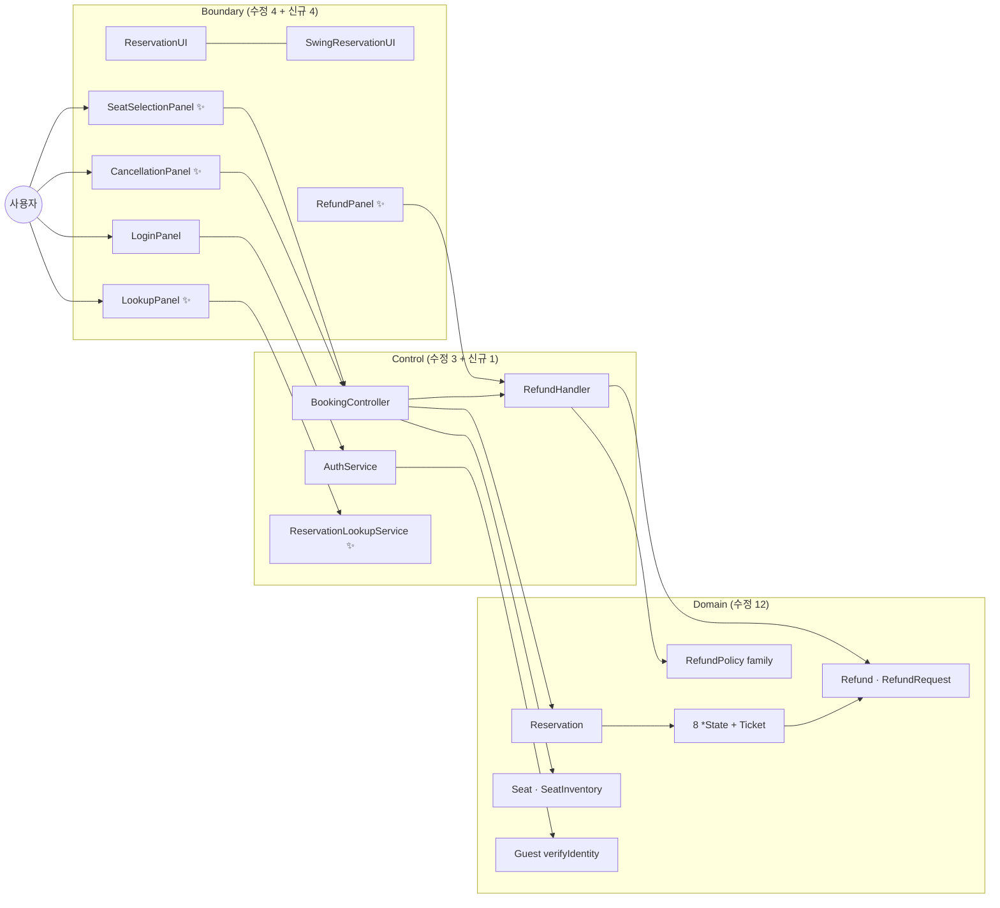
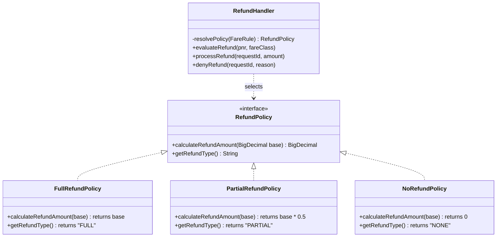
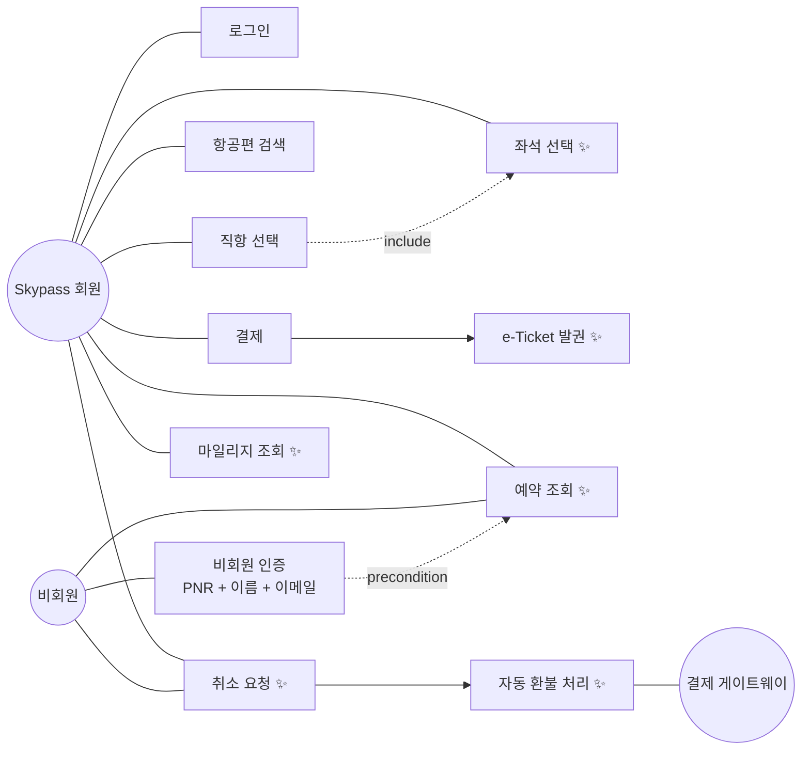
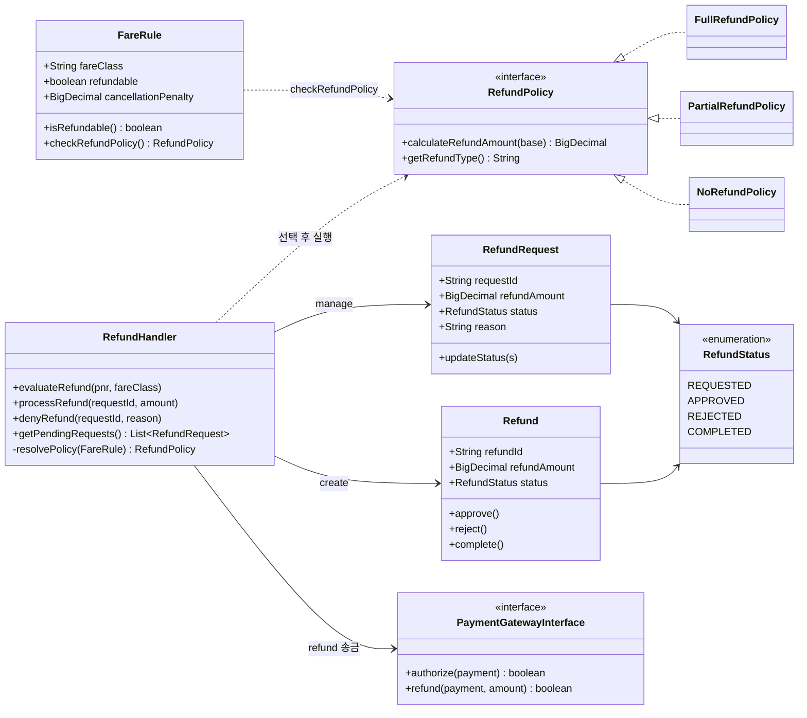
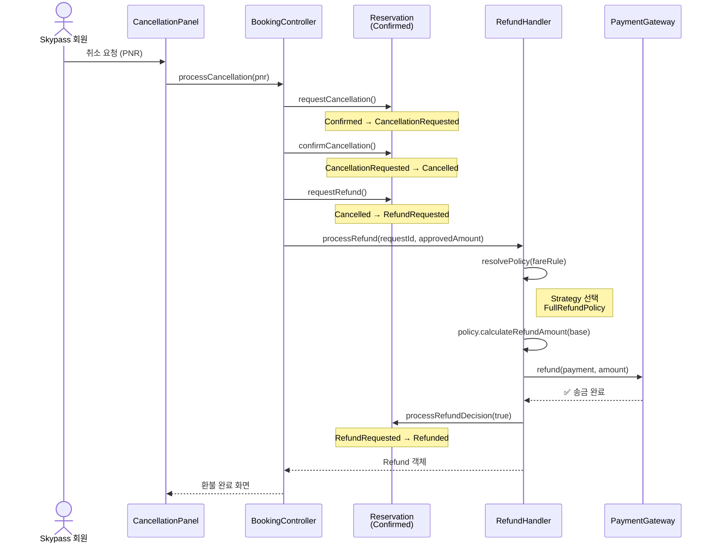
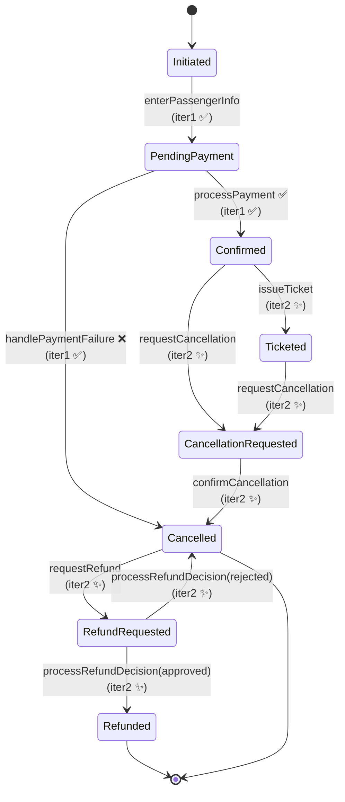
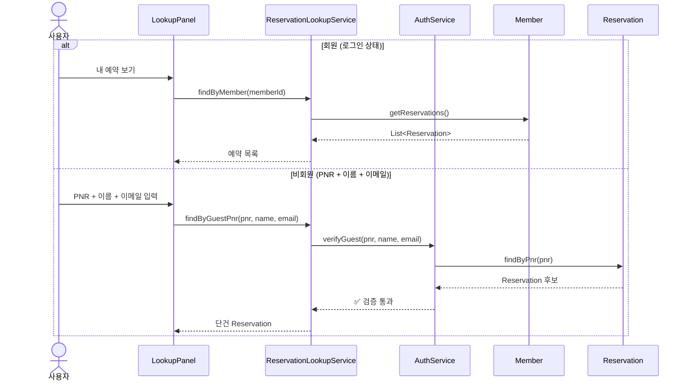
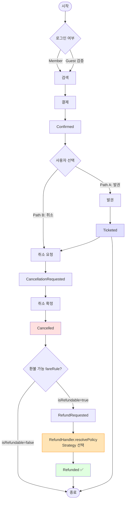
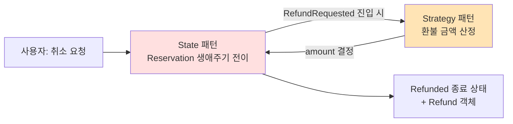

<div align="center">

# ✈️ Iteration 2 — Feature Inventory & Strategy 패턴 (RefundPolicy family)

### 대한항공 Skypass 티켓 예약 시스템

[](https://github.com/gimjungwook/KoreanAirReservationDomain)
[](#-1-iteration-2-범위)
[](#-2-strategy-패턴-도입-동기)
[](https://github.com/gimjungwook/KoreanAirReservationDomain)

[**⬅ Iteration 1 (State, Walking Skeleton)**](iteration-1-ko.md) · [**📂 Source code**](https://github.com/gimjungwook/KoreanAirReservationDomain)

</div>

> [!IMPORTANT]
> ### 📣 Iteration 1 → Iteration 2
> **Iteration 1에서는 8개 기능을 얇게 끝까지 통과시키는 walking skeleton을 만들었다.** Iteration 2는 그 위에 Strategy 패턴(`RefundPolicy` family)을 중심으로 **취소·환불·발권·예약 조회**를 본격적으로 채운다. 본 발표는 (1) Strategy 도입 동기, (2) 새로 활성화되는 5개 State 전이, (3) 11개 sub-feature가 어떻게 코드로 떨어졌는지를 다룬다.

### 🗺 발표 흐름

| 단계 | 발표 내용 | 본문 위치 |
| :---: | :--- | :---: |
| **1** | 🚧 Iteration 1에서 의도적으로 비워둔 곳을 어떻게 채웠는지 | [1번](#-1-iteration-2-범위) · [6번](#-6-iteration-2-구현) |
| **2** | 🎯 Strategy 패턴이 환불 정책 분기를 어떻게 구조화하는지 | [2번](#-2-strategy-패턴-도입-동기) · [4.2번](#42-class-diagram--strategy-family) |
| **3** | 🚀 새로 활성화된 5개 State 전이와 종단 시연 | [4.4번](#44-state-diagram--iter-2-transitions) · [6번](#-6-iteration-2-구현) |

### 🩹 Iteration 1과 비교

| | 영역 | Iteration 1 | Iteration 2 |
| :---: | :--- | :--- | :--- |
| 🔄 | **State 전이** | 3개 활성 (`enterPassengerInfo`, `processPayment`, `handlePaymentFailure`) | **+5개 활성** (`issueTicket`, `requestCancellation`, `confirmCancellation`, `requestRefund`, `processRefundDecision`) |
| 🎨 | **패턴** | State (8개 구상 클래스) | State + **Strategy** (`RefundPolicy` family) |
| 🎫 | **발권** | 미연결 (전이 선언만) | `Ticket` 발급 + 좌석 배정 + e-Ticket 데이터 생성 |
| 💸 | **환불** | 미구현 | `RefundHandler` 오케스트레이션 + 정책 자동 선택 + PG 환불 송금 |
| 🔍 | **조회** | 없음 | 회원 예약 이력 + 비회원 PNR 단건 조회 |
| 🪑 | **좌석 선택** | 없음 (자동) | 좌석 맵 표시 + 사용자 선택 |
| 🔐 | **인증** | 평문 비교 | salted-hash 검증 + Guest verifyIdentity(PNR + 이름 + 이메일) |

---

| 항목 | 내용 |
| --- | --- |
| 과목 | ECE312 객체지향 설계패턴 (2026년 1학기) |
| 제출물 | Iteration 2 — 9~10주차 (Iter 2 시연 + 회고) |
| 팀 | A팀 — 김정욱, 이재호, 김경동 |
| 소스 베이스라인 | `KoreanAirReservationDomain` (자바 17, Eclipse 프로젝트) |
| Iteration 1 결과물 | [Iteration 1 보고서](iteration-1-ko.md) (Walking Skeleton) |

---

## 📌 0. 실행 방법 및 시연

### 0.1 컴파일

```bash
cd KoreanAirReservationDomain
javac -sourcepath src -d bin $(find src -name "*.java" | grep -v "tools/")
```

### 0.2 실행

| 모드 | 진입점 | Iteration 2 시연 흐름 |
| --- | --- | --- |
| 콘솔 | `com.koreanair.reservation.app.App` | 검색 → 예약 → 결제 → **발권 → 취소 요청 → 환불 자동 처리** |
| Swing GUI | `com.koreanair.reservation.app.swing.SwingApp` | 위 흐름 + **예약 조회 화면 + 좌석 선택 패널 + 환불 진행 패널** |

```bash
java -cp bin com.koreanair.reservation.app.swing.SwingApp
```

### 0.3 콘솔 출력 예 (Iteration 2 종단 시연)

```
[STATE] Initiated -> PendingPayment
[STATE] PendingPayment -> Confirmed
[STATE] Confirmed -> Ticketed                          ← Iter 2 신규
[TICKET] e-Ticket KE-251020-0001 issued for 김정욱
[STATE] Ticketed -> CancellationRequested              ← Iter 2 신규
[STATE] CancellationRequested -> Cancelled             ← Iter 2 신규
[STATE] Cancelled -> RefundRequested                   ← Iter 2 신규
[STRATEGY] FareRule(Y) -> FullRefundPolicy -> 500,000 KRW
[STATE] RefundRequested -> Refunded                    ← Iter 2 신규
[REFUND] Refund-2510-001 disbursed via mock PG
```

---

## 📌 1. Iteration 2 범위

> [!NOTE]
> 🩹 **발표 단계 1 / 3** — Iteration 1이 의도적으로 stub로 남겨둔 corner를 닫는다.

### 1.1 한 문단 요약

Iteration 2는 iteration 1에서 만들어진 예약을 **조회·발권·취소·환불 가능한 대상**으로 확장한다. 회원과 비회원 모두 PNR로 자기 예약을 찾을 수 있어야 하므로 **예약 조회 기능**이 먼저 들어간다. `Confirmed` / `Ticketed` 상태의 예약에 대해서만 취소 요청을 받고, 운임 규칙에 따라 환불 정책이 달라지므로 **Strategy 패턴**의 주 적용 지점이 된다. switch 기반 환불 구현은 새 운임 클래스가 추가될 때 환불 코드, 취소 코드, 보고 코드를 함께 건드릴 위험이 있다. Strategy는 각 환불 규칙을 `RefundPolicy` 구현 클래스로 분리하고, `RefundHandler`는 선택된 정책만 실행하게 만든다.

### 1.2 Iteration 1과의 코드 차이 (요약)

```
src/com/koreanair/reservation/
├── domain/
│   ├── reservation/state/
│   │   ├── ConfirmedState.java               ← issueTicket, requestCancellation 본문 채움
│   │   ├── TicketedState.java                ← requestCancellation 본문 채움
│   │   ├── CancellationRequestedState.java   ← confirmCancellation 본문 채움
│   │   ├── CancelledState.java               ← requestRefund 본문 채움
│   │   ├── RefundRequestedState.java         ← processRefundDecision 본문 채움
│   │   └── RefundedState.java                ← terminal 상태 (전이 거부 유지)
│   ├── reservation/
│   │   ├── Reservation.java                  ← findByPnr, getReservationDetail, addTicket 채움
│   │   └── Ticket.java                       ← 생성자, generate(), getByReservation 채움
│   ├── payment/
│   │   ├── RefundPolicy.java                 ← (Iter 1에서 이미 인터페이스 정의)
│   │   ├── FullRefundPolicy.java             ← (Iter 1에서 이미 구현)
│   │   ├── PartialRefundPolicy.java          ← (Iter 1에서 이미 구현)
│   │   ├── NoRefundPolicy.java               ← (Iter 1에서 이미 구현)
│   │   ├── Refund.java                       ← 생성자 추가, 상태 전이 보강
│   │   └── RefundRequest.java                ← 본문 채움
│   ├── flight/
│   │   ├── FareRule.java                     ← checkRefundPolicy 본문 채움
│   │   ├── SeatInventory.java                ← reserve, release 본문 채움
│   │   └── Seat.java                         ← hold/release 생애주기 보강
│   └── passenger/
│       ├── Guest.java                        ← verifyIdentity 본문 채움
│       └── SkypassMember.java                ← 마일리지 잔액 조회 보강
├── control/
│   ├── BookingController.java                ← processCancellation, assignSeat 채움
│   ├── RefundHandler.java                    ← 5개 메서드 본문 채움
│   ├── AuthService.java                      ← salted-hash, Guest 검증 추가
│   └── ReservationLookupService.java         ← 신규 (회원/비회원 조회 분기)
└── app/swing/
    ├── LookupPanel.java                      ← 신규 (회원/비회원 PNR 조회 UI)
    ├── SeatSelectionPanel.java               ← 신규 (좌석 맵 + 선택)
    ├── CancellationPanel.java                ← 신규 (취소 사유 입력 + 환불 미리보기)
    └── RefundPanel.java                      ← 신규 (환불 진행 표시)
```

총 변경: 약 **22개 파일** (수정 16 + 신규 6).

### 1.3 ECB 계층별 변경 요약



---

## 📌 2. Strategy 패턴 도입 동기

> [!NOTE]
> 🩹 **발표 단계 2 / 3** — 이번 iteration의 주축 패턴이 풀어내는 문제.

### 2.1 문제: 운임별 환불 분기

대한항공 운임은 운임 규칙에 따라 환불 가능 여부와 환불 비율이 다르다. 단순 if/else / switch 로 표현하면:

```java
// 안티패턴 — 환불 정책이 RefundHandler 내부에 박힌다
public BigDecimal calculateRefund(FareRule rule, BigDecimal base) {
    if (!rule.isRefundable()) return BigDecimal.ZERO;
    if ("Y".equals(rule.getFareClass())) return base;
    if ("B".equals(rule.getFareClass())) return base;
    if ("M".equals(rule.getFareClass())) return base.multiply(new BigDecimal("0.5"));
    if ("L".equals(rule.getFareClass())) return base.multiply(new BigDecimal("0.3"));
    // ...새 운임이 추가될 때마다 RefundHandler 를 수정.
    return BigDecimal.ZERO;
}
```

이 구조의 문제:

1. **새 운임 클래스 추가 = `RefundHandler` 수정** (Open-Closed 위반).
2. **취소 페널티·보고서·관리자 검토 분기**까지 같은 if 사슬에 모이면 폭발한다.
3. **테스트가 어렵다**. 정책 1건만 검증하려면 전체 분기를 통과해야 한다.

### 2.2 해법: Strategy 패턴

각 환불 규칙을 `RefundPolicy` 구현 클래스로 분리한다. `RefundHandler`는 `FareRule`을 보고 적절한 `RefundPolicy`를 선택해서 실행만 한다.



### 2.3 패턴 적용 후 코드

```java
// RefundHandler 내부 — 정책 선택은 한 메서드로 격리.
private RefundPolicy resolvePolicy(FareRule fareRule) {
    if (fareRule == null || !fareRule.isRefundable()) return new NoRefundPolicy();
    String fc = fareRule.getFareClass();
    if ("Y".equals(fc) || "B".equals(fc)) return new FullRefundPolicy();
    return new PartialRefundPolicy();
}

// 환불 금액 계산 — 어떤 정책인지 모르고 호출.
public BigDecimal evaluateRefund(FareRule rule, BigDecimal base) {
    return resolvePolicy(rule).calculateRefundAmount(base);
}
```

새 운임 (`E`, `K`, ...) 이 추가되면 `XXXRefundPolicy` 클래스를 추가하고 `resolvePolicy` 의 매핑 한 줄을 추가한다. **`RefundHandler` 의 다른 코드는 손대지 않는다.**

### 2.4 왜 다른 패턴이 아닌가

| 후보 패턴 | 적합도 | 기각 이유 |
| --- | :---: | --- |
| **Strategy** | ✅ | 환불 알고리즘 family — 동일 인터페이스로 교체 가능. 본 iter 적용 |
| State | ❌ | 객체의 생애주기 전이 (이미 `Reservation` 본체에서 사용 중) — 환불 정책은 객체 상태가 아니다 |
| Template Method | △ | 정책마다 매우 다른 계산. 공통 골격이 거의 없다 |
| Chain of Responsibility | △ | 하나의 정책만 적용되면 충분. 체인이 과잉 |
| Decorator | ❌ | 환불 정책이 누적되지 않는다 (FullRefund + PartialRefund 같은 합성 없음) |

---

## 📊 3. Iteration 2 기능 분해

> [!NOTE]
> Iteration 1 보고서 §3.2의 11개 sub-feature를 Iteration 2 코드에 매핑.

| # | Category | Sub-feature | 시연 포인트 | 핵심 클래스/메서드 |
| :---: | :--- | :--- | :--- | :--- |
| 1 | Authentication | Member profile · 마일리지 잔액 조회 | 로그인 후 마일리지 잔액 표시 | `SkypassMember.getMileageAccount()`, `MileageAccount.getBalance()` |
| 2 | Authentication | Guest verification | PNR + 이름 + 이메일로 비회원 인증 | `Guest.verifyIdentity(pnr, name, email)`, `AuthService.verifyGuest(...)` |
| 3 | Booking Flow | Seat selection | 예약 확정 전 좌석 맵 + 선택 | `SeatInventory.reserve(BookingClass)`, `BookingController.assignSeat(Reservation, seatNumber)`, `SeatSelectionPanel` |
| 4 | Reservation Lookup | Member 예약 이력 | 회원 ID로 모든 예약 조회 | `ReservationLookupService.findByMember(Member)`, `Member.getReservations()` |
| 5 | Reservation Lookup | Guest 단건 조회 | 검증된 비회원의 PNR 단건 조회 | `ReservationLookupService.findByGuestPnr(pnr, name, email)`, `Reservation.findByPnr(pnr)` |
| 6 | Cancellation/Refund | Cancellation 요청 접수 | `Confirmed`/`Ticketed` 에서만 수락 | `Reservation.requestCancellation()`, `ConfirmedState.requestCancellation`, `TicketedState.requestCancellation` |
| 7 | Cancellation/Refund | 환불 가능 여부 판단 | `FareRule.isRefundable()` 체크 | `FareRule.checkRefundPolicy()`, `CancelledState.requestRefund` |
| 8 | Cancellation/Refund | **환불 정책 선택 (Strategy)** | `RefundHandler.resolvePolicy(FareRule)` | **`RefundPolicy` family** + `RefundHandler.resolvePolicy()` |
| 9 | Cancellation/Refund | 자동 환불 처리 | 선택된 Strategy 로 금액 산정 | `RefundHandler.processRefund(requestId, approvedAmount)` |
| 10 | Cancellation/Refund | 환불 지급 (PG 송금) | 결제 게이트웨이 환불 송금 | `RefundHandler.processRefund` → `PaymentGatewayInterface.refund(...)` |
| 11 | e-Ticket | e-Ticket 발권 | PNR + Confirmed → Ticketed 전이 + Ticket 객체 생성 | `Reservation.issueTicket()`, `ConfirmedState.issueTicket`, `Ticket.generate(...)` |

### 3.1 기능 ↔ Use Case ↔ State 전이 매핑

| Sub-feature | Use Case | 활성화되는 State 전이 |
| --- | --- | --- |
| #6 Cancellation 요청 접수 | UC-Cancel | `Confirmed → CancellationRequested`, `Ticketed → CancellationRequested` |
| #7 환불 가능 여부 판단 | UC-Cancel-Confirm | `CancellationRequested → Cancelled`, `Cancelled → RefundRequested` |
| #8-9 환불 정책 + 자동 처리 | UC-Refund-Process | `RefundRequested → Refunded` (approved=true) |
| #10 환불 지급 | UC-Refund-Process (sub) | (state 전이 없음, RefundHandler 단계) |
| #11 e-Ticket 발권 | UC-IssueTicket | `Confirmed → Ticketed` |
| #4-5 예약 조회 | UC-Lookup | (state 전이 없음, 읽기 전용) |
| #2 Guest verifyIdentity | UC-Lookup (precondition) | (state 전이 없음) |
| #3 Seat selection | UC-Book (sub-step) | (state 전이 없음, `Reservation` 동안 좌석 추가) |
| #1 마일리지 잔액 조회 | UC-Login (post) | (state 전이 없음) |

---

## 🎨 4. UML 다이어그램 — Iteration 2

> [!NOTE]
> 본 섹션의 4종 다이어그램은 **Iteration 2 시연 범위**를 보여준다. Iteration 1 doc의 다이어그램은 walking skeleton 만 다뤘으므로, 여기서 새로 활성화된 영역을 강조한다.

### 4.1 Use Case Diagram — Iteration 2



✨ = Iteration 2에서 새로 활성화된 use case.

### 4.2 Class Diagram — Strategy family



### 4.3 Sequence Diagram — Cancel & Refund



### 4.4 State Diagram — Iter 2 transitions

Iteration 1에서는 3개 전이만 활성. Iteration 2에서 **5개 전이가 추가로 활성화** 된다.



> Iter 1 활성: 3개. Iter 2 추가 활성: 7개. 누적: **10개 전이**.

### 4.5 Reservation lookup 흐름 (신규)



---

## 🏛 5. Iteration 2 핵심 클래스

| 클래스 | ECB 역할 | Iter 2 책임 | 핵심 메서드 (Iter 2 활성) |
| --- | --- | --- | --- |
| `RefundPolicy` (interface) | Domain — Strategy contract | 환불 금액 계산 family 의 공통 계약 | `calculateRefundAmount(base)`, `getRefundType()` |
| `FullRefundPolicy` | Domain — Strategy concrete | 100% 환불 (운임 Y/B 등) | `calculateRefundAmount(base) → base` |
| `PartialRefundPolicy` | Domain — Strategy concrete | 50% 환불 (M, L 등) | `calculateRefundAmount(base) → base / 2` |
| `NoRefundPolicy` | Domain — Strategy concrete | 환불 불가 (rule.refundable == false) | `calculateRefundAmount(base) → 0` |
| `RefundHandler` | Control — Strategy 선택 + orchestration | `resolvePolicy(FareRule)` 로 정책 선택 후 환불 송금 | `evaluateRefund`, `processRefund`, `denyRefund`, `getPendingRequests` |
| `Refund` | Domain — Entity | 완료된 환불 거래 | `approve()`, `reject()`, `complete()` |
| `RefundRequest` | Domain — Entity | 환불 요청 (검토 중) | `updateStatus(RefundStatus)` |
| `Ticket` | Domain — Entity | e-Ticket 데이터 + 좌석 배정 링크 | `generate(reservation, passenger, seat)`, `issue()`, `cancel()`, `getByReservation(pnr)` |
| `ConfirmedState` (iter2 활성) | Domain — State concrete | `issueTicket → Ticketed`, `requestCancellation → CancellationRequested` | `issueTicket(ctx)`, `requestCancellation(ctx)` |
| `TicketedState` (iter2 활성) | Domain — State concrete | `requestCancellation → CancellationRequested` | `requestCancellation(ctx)` |
| `CancellationRequestedState` | Domain — State concrete | `confirmCancellation → Cancelled` | `confirmCancellation(ctx)` |
| `CancelledState` | Domain — State concrete | `requestRefund → RefundRequested` (FareRule 검사) | `requestRefund(ctx)` |
| `RefundRequestedState` | Domain — State concrete | `processRefundDecision(approved) → Refunded` 또는 `Cancelled` | `processRefundDecision(ctx, approved)` |
| `BookingController` (iter2 추가) | Control | 취소·환불 오케스트레이션 + 좌석 배정 | `processCancellation(pnr)`, `assignSeat(Reservation, seatNumber)` |
| `ReservationLookupService` ✨ | Control (신규) | 회원/비회원 분기 조회 | `findByMember(Member)`, `findByGuestPnr(pnr, name, email)` |
| `AuthService` (iter2 추가) | Control | salted-hash 검증 + Guest 인증 | `loginWithHash(skypass, password)`, `verifyGuest(pnr, name, email)` |
| `Guest` (iter2 활성) | Domain — Passenger subclass | 비회원 검증 | `verifyIdentity(pnr, name, email)` |
| `SeatInventory` (iter2 활성) | Domain — Aggregate | 좌석 잔여 관리 | `reserve(BookingClass)`, `release(BookingClass)` |
| `LookupPanel` ✨ | Boundary (신규) | 예약 조회 입력 화면 | (Swing 컴포넌트) |
| `SeatSelectionPanel` ✨ | Boundary (신규) | 좌석 맵 + 사용자 선택 | (Swing 컴포넌트) |
| `CancellationPanel` ✨ | Boundary (신규) | 취소 사유 + 환불 미리보기 | (Swing 컴포넌트) |
| `RefundPanel` ✨ | Boundary (신규) | 환불 진행 상태 표시 | (Swing 컴포넌트) |

---

## 🚀 6. Iteration 2 구현

### 6.1 Walking Skeleton → Expanded Skeleton

Iteration 1의 walking skeleton은 **하나의 happy path**가 끝까지 동작했다 (검색 → 결제). Iteration 2의 expanded skeleton은 **세 갈래** path 가 모두 끝까지 동작한다:



### 6.2 핵심 시연 시나리오

#### 시나리오 1 — e-Ticket 발권 (Path A)

1. 회원 로그인 (salted-hash 검증)
2. ICN→NRT 직항편 검색·선택
3. 좌석 선택 (`SeatSelectionPanel`)
4. 승객 정보 + 결제 → `Confirmed`
5. **e-Ticket 발권 버튼** → `Confirmed → Ticketed`, `Ticket` 객체 생성, e-Ticket 번호 발급
6. 화면에 e-Ticket 정보 표시

#### 시나리오 2 — 자동 환불 (Path B, Strategy 시연 핵심)

1. 위 시나리오 1을 거쳐 `Ticketed` 상태인 예약 준비
2. `LookupPanel`에서 PNR로 조회
3. `CancellationPanel`에서 취소 사유 입력 + **환불 미리보기** (`RefundHandler.evaluateRefund` → 어떤 Strategy 선택되는지 표시)
4. 확인 → `Ticketed → CancellationRequested → Cancelled → RefundRequested`
5. `RefundHandler.processRefund` → Strategy 자동 선택 (Y class → `FullRefundPolicy`) → mock PG 환불 송금
6. `RefundRequested → Refunded`, `RefundPanel`에 완료 표시

#### 시나리오 3 — 비환불 운임 (NoRefundPolicy 시연)

- 운임 L 클래스 (`fareRule.isRefundable() == false`) 예약을 취소 시도
- `RefundHandler.resolvePolicy` 가 `NoRefundPolicy` 선택 → 환불 금액 0원
- 사용자에게 환불 불가 안내, `Cancelled` 상태로 종료 (RefundRequested 로 가지 않음)

#### 시나리오 4 — 비회원 조회 (Guest verification)

1. 비회원이 LookupPanel 에서 PNR + 이름 + 이메일 입력
2. `AuthService.verifyGuest` → `Guest.verifyIdentity` 검증
3. 통과 → 단건 Reservation 표시, 취소·환불 진행 가능

### 6.3 State 패턴 + Strategy 패턴의 협업

Iteration 1에서 도입한 State 패턴과 Iteration 2에서 도입한 Strategy 패턴이 어떻게 협업하는지가 본 iter 의 핵심 발표 포인트다.



**역할 분리:**

- **State**: "지금 어떤 전이가 허용되는가" — `Confirmed` 에서만 `requestCancellation` 허용, `Refunded` 는 종착.
- **Strategy**: "얼마를 환불할 것인가" — fareRule 만 보고 결정, 상태 무관.

두 패턴이 **다른 축**을 변화시킨다는 점이 클래스 분리의 정당성. 같은 if 사슬에 둘 다 박으면 두 축이 얽힌다.

---

## 🚧 7. Iteration 2 한계 (의도적)

> [!NOTE]
> Iteration 2 시연은 끝까지 동작한다. 다만 Iteration 3에서 명시적으로 닫을 corner를 미리 나열한다.

- **환불 송금은 mock PG 다.** `MockPaymentGateway.refund(...)` 는 즉시 `true` 반환. 실제 PG 환불 API 호출은 Iteration 4 영역.
- **Observer 미도입.** 좌석 hold 만료, 결제 실패 후 자동 취소, FlightSchedule 변경 전파 — 모두 Iteration 3에서 다룬다. 본 iter 는 명시적 호출 (`BookingController.processCancellation`) 로 트리거.
- **환승·multi-city 미지원.** `Itinerary` 와 `Segment` 클래스는 stub 그대로 둔다. Iteration 3에서 connecting flight 검색 + MCT 검증 도입.
- **마일리지 적용 결제 미지원.** Iteration 2 는 **잔액 조회만** 추가하고, 마일리지 차감 결제는 Iteration 3.
- **관리자 예외 환불 미도입.** 본 iter 는 `RefundHandler.resolvePolicy` 가 자동으로 정책 선택. 관리자가 검토·반려하는 경로는 Iteration 4의 Singleton + Factory Method 와 함께.
- **e-Ticket PDF 미지원.** Ticket 객체는 만들어지지만 PDF export 는 Iteration 4.
- **Reservation 영속화는 in-memory.** `Reservation.findByPnr(pnr)` 는 in-memory 맵에서 조회. DB 연동 없음.
- **salted-hash 는 SHA-256 + per-member salt 수준.** 운영 등급 KDF (bcrypt, scrypt, Argon2) 는 본 학기 학습 범위 밖.
- **GDS Interface 는 stub.** `boundary.GDSInterface` 는 인터페이스만 존재. Iteration 3에서 외부 GDS mock 어댑터 도입.

---

## 🔮 8. 다음 Iteration 개요

### 8.1 Iteration 3 — Observer 패턴

- 좌석 15분 hold 만료 이벤트 → 자동 좌석 해제, 관련 Reservation 알림
- 결제 실패 이벤트 → 자동 취소 (`Reservation.handlePaymentFailure` 가 단순 호출이 아니라 publisher)
- `FlightSchedule.changeStatus` 이벤트 → 관련 모든 Reservation 으로 전파
- Connecting flight 검색 + Multi-city 일정 (Itinerary 본격 활용)
- 마일리지 적용 결제 + 외부 Skypass 시스템 검증

### 8.2 Iteration 4 — Singleton (+ 옵션 Factory Method)

- `AppConfig` Singleton — 폰트/언어/통화 단위 전역 설정
- `ItineraryFactory.create(Direct | Connecting | MultiCity)` Factory Method — `Itinerary` 종류별 생성 로직 분리
- 관리자 예외 환불 검토 경로 (자동 처리 밖)
- e-Ticket PDF 다운로드
- Reservation 상태 실시간 추적 (Iteration 3 Observer 위에서)

---

<div align="center">

<sub>ECE312 객체지향 설계패턴 · 한동대학교 · 2026년 1학기 · A팀 (김정욱 · 이재호 · 김경동)</sub>

<sub>Made with ☕ and the Gang-of-Four book · Iteration 2 — Strategy Pattern</sub>

</div>
