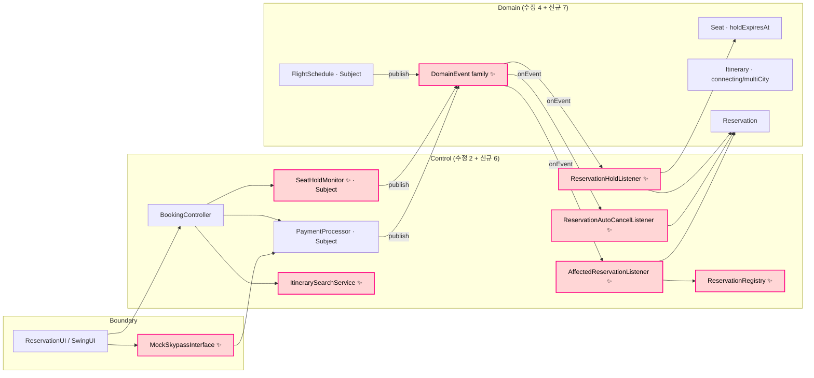
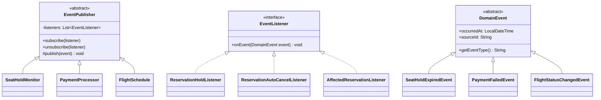
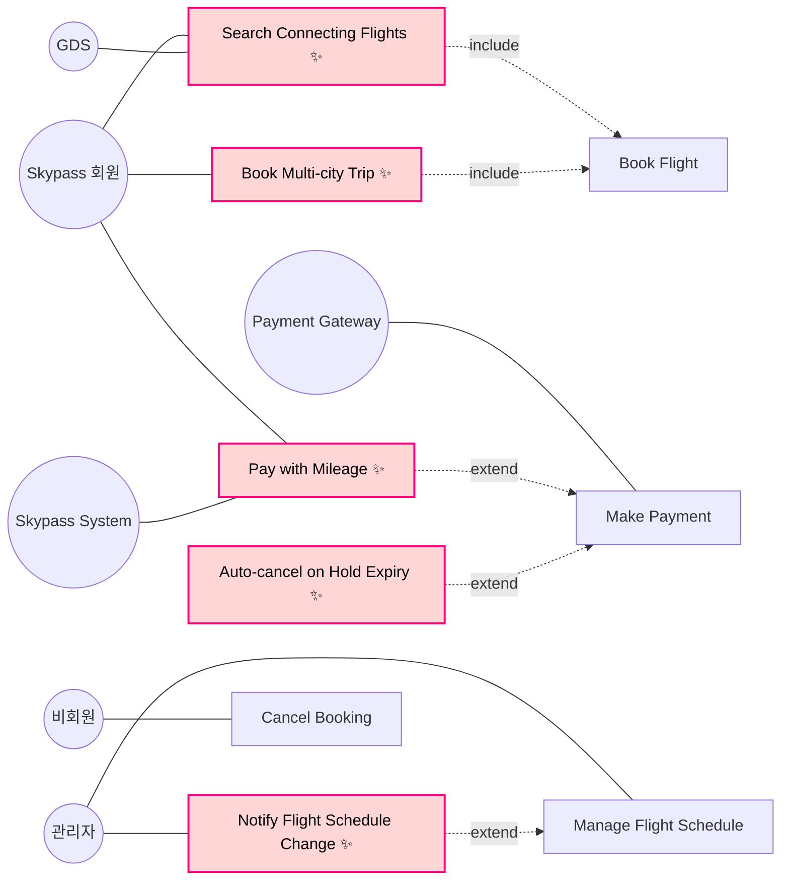
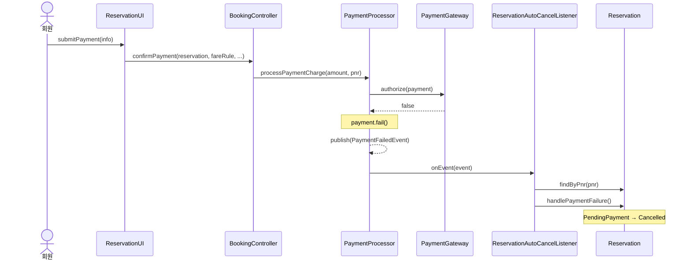
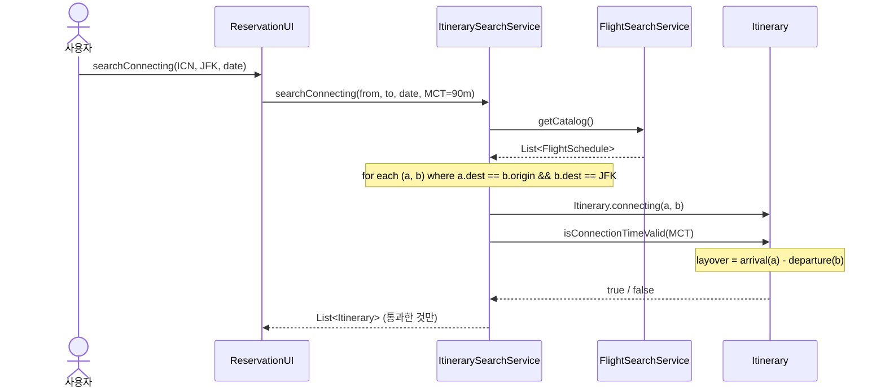

<div align="center">

# ✈️ Iteration 3 — Observer 패턴 (좌석 hold · 결제 실패 · FlightSchedule 전파)

### 대한항공 Skypass 티켓 예약 시스템

[](https://github.com/gimjungwook/KoreanAirReservationDomain)
[](#-1-iteration-3-범위)
[](#-2-observer-패턴-도입-동기)
[](https://github.com/gimjungwook/KoreanAirReservationDomain)

[**⬅ Iteration 2 (Strategy, RefundPolicy)**](iteration-2-ko.md) · [**📂 Source code**](https://github.com/gimjungwook/KoreanAirReservationDomain)

</div>

> [!IMPORTANT]
> ### 📣 Iteration 2 → Iteration 3
> **Iteration 2까지 walking skeleton의 happy path와 한 갈래 cancel/refund 분기를 마쳤습니다.** Iteration 3은 부수효과의 책임을 호출자에서 listener로 분리합니다. (1) 좌석 hold 15분 만료 자동 해제, (2) 결제 실패 시 자동 취소, (3) FlightSchedule 변경의 N개 Reservation 전파 — 세 흐름이 동일한 Observer 인프라를 공유합니다. 함께 Itinerary 환승·multi-city와 마일리지 결제도 활성화합니다.

### 🗺 발표 흐름

| 단계 | 발표 내용 | 본문 위치 |
| :---: | :--- | :---: |
| **1** | 📡 호출자가 떠안던 부수효과 호출을 listener로 위임한 이유 | [1번](#-1-iteration-3-범위) · [2번](#-2-observer-패턴-도입-동기) |
| **2** | 🎯 동일 인프라(EventPublisher/EventListener) 위에 3개 Subject를 얹은 구조 | [4.2번](#42-class-diagram--observer-family) · [6번](#-6-iteration-3-구현) |
| **3** | 🚀 Connecting 일정 + 마일리지 결제로 walking skeleton 마지막 칸을 메운다 | [4.5번](#45-itinerary--mileage-흐름) · [6번](#-6-iteration-3-구현) |

### 🩹 Iteration 2와 비교

| | 영역 | Iteration 2 | Iteration 3 |
| :---: | :--- | :--- | :--- |
| 📡 | **부수효과 처리** | 호출자(BookingController)에서 직접 호출 | Subject가 publish, **3개 listener가 수신·처리** |
| 🪑 | **좌석 hold 만료** | 미구현 (수동 해제) | **SeatHoldMonitor.sweep + 자동 해제 + 예약 취소** |
| 💳 | **결제 실패** | 호출자에서 `handlePaymentFailure` 호출 | **PaymentFailedEvent → AutoCancelListener** |
| ✈️ | **항공편 변경** | 미구현 (stub) | **FlightSchedule.changeStatus publish + 영향 Reservation 통지** |
| 🛫 | **Itinerary** | DIRECT 1 segment만 | **CONNECTING + MULTI_CITY · MCT 검증** |
| 💴 | **결제 수단** | 카드 결제만 | **MILEAGE 결제 분기 + Skypass mock** |
| 🔌 | **외부 GDS / Skypass** | stub | `MockSkypassInterface` (in-memory mock) |

---

| 항목 | 내용 |
| --- | --- |
| 과목 | ECE312 객체지향 설계패턴 (2026년 1학기) |
| 제출물 | Iteration 3 — 11~12주차 |
| 팀 | A팀 — 김정욱, 이재호, 김경동 |
| 소스 베이스라인 | `KoreanAirReservationDomain` (자바 17, Eclipse 프로젝트) |
| 이전 결과물 | [Iteration 1 보고서](iteration-1-ko.md) · [Iteration 2 보고서](iteration-2-ko.md) |

---

## 📌 0. 실행 방법

### 0.1 컴파일

```bash
cd KoreanAirReservationDomain
javac -sourcepath src -d bin $(find src -name "*.java" | grep -v "tools/")
```

### 0.2 Swing UI 실행

```bash
java -cp bin com.koreanair.reservation.app.swing.SwingApp
```

---

## 📌 1. Iteration 3 범위

### 1.1 한 문단 요약

Iteration 3은 iteration 2까지의 호출자-중심 흐름을 publisher-listener 분리로 재편합니다. 좌석 hold 만료·결제 실패·FlightSchedule 변경 — 이 세 가지는 모두 **"발행자는 자신의 상태 변화를 모르는 다른 객체에게 통지"** 라는 동일 시나리오를 가지므로 Observer 패턴을 한 번 도입하면 세 곳에서 재사용됩니다. 함께 Itinerary 환승·multi-city와 마일리지 결제도 활성화하여 walking skeleton의 마지막 빈 칸을 메웁니다.

### 1.2 Iteration 2와의 코드 차이 (요약)

```
src/com/koreanair/reservation/
├── domain/
│   ├── event/                                ← 신규 패키지
│   │   ├── DomainEvent.java                  ← 신규 (abstract)
│   │   ├── EventListener.java                ← 신규 (interface)
│   │   ├── EventPublisher.java               ← 신규 (abstract Subject)
│   │   ├── SeatHoldExpiredEvent.java         ← 신규
│   │   ├── PaymentFailedEvent.java           ← 신규
│   │   ├── FlightStatusChangedEvent.java     ← 신규
│   │   └── ReservationStateChangedEvent.java ← 신규
│   ├── flight/
│   │   ├── Seat.java                         ← holdExpiresAt + isHoldExpired 추가
│   │   └── FlightSchedule.java               ← extends EventPublisher · changeStatus 발행
│   ├── reservation/
│   │   ├── Itinerary.java                    ← connecting() · multiCity() · MCT 검증
│   │   └── Reservation.java                  ← setReservationNumber → ReservationRegistry 등록
│   └── payment/
│       └── PaymentMethod.java                ← MILEAGE 추가
├── control/
│   ├── PaymentProcessor.java                 ← extends EventPublisher · processMileagePayment
│   ├── BookingController.java                ← confirmMileagePayment · 실패 직접 호출 제거
│   ├── SeatHoldMonitor.java                  ← 신규 Subject
│   ├── ReservationHoldListener.java          ← 신규 Listener
│   ├── ReservationAutoCancelListener.java    ← 신규 Listener
│   ├── AffectedReservationListener.java      ← 신규 Listener
│   ├── ReservationRegistry.java              ← 신규
│   └── ItinerarySearchService.java           ← 신규 (1-stop 환승 탐색)
└── boundary/
    └── MockSkypassInterface.java             ← 신규 (외부 Skypass mock)
```

총 변경: **수정 6 + 신규 13 ≈ 19 파일.**

### 1.3 ECB 계층별 변경 요약



- 세 개의 Subject(`SeatHoldMonitor`, `PaymentProcessor`, `FlightSchedule`)가 모두 `EventPublisher`를 상속.
- 세 개의 Listener는 `EventListener` 인터페이스를 통해 각자의 `DomainEvent` 하위 타입만 처리.
- `BookingController`는 부수효과 호출이 사라져 책임이 가벼워집니다 (확장 가능성은 listener 등록만으로 추가).

---

## 📌 2. Observer 패턴 도입 동기

### 2.1 문제: 부수효과 발생원 3개로 늘면서 호출자가 비대해진다

Iteration 2까지는 호출자가 자기 책임 외의 후속 처리를 직접 호출했습니다:

```java
// iter2 BookingController.confirmPayment
Payment payment = paymentProcessor.processPaymentCharge(total);
if (payment.getStatus() == PaymentStatus.PAID) {
    reservation.addPayment(payment);
    reservation.processPayment();
} else {
    reservation.handlePaymentFailure();   // 호출자가 부수효과 책임
}
```

Iteration 3에서 같은 "예약 자동 취소"가 필요한 발생원이 추가됩니다:
1. **좌석 hold 15분 만료** — SeatHoldMonitor가 발견
2. **결제 실패** — PaymentProcessor가 발견
3. **FlightSchedule.changeStatus(CANCELLED)** — 관리자 명령

세 곳 모두 호출자에서 직접 `handlePaymentFailure`를 호출하면:
- 호출자가 N배로 비대해진다
- 같은 코드가 세 곳에 복제된다 (Reservation.findByPnr + handlePaymentFailure 패턴)
- 새 발생원이 늘 때마다 호출자 수정 (OCP 위반)

### 2.2 해법: Observer 패턴

각 발생원을 **Subject**로 격상하고, 부수효과는 **Listener**로 분리합니다.



- `EventPublisher`가 구독자 관리 + broadcast를 공통 처리.
- `EventListener.onEvent(DomainEvent)`에서 `instanceof`로 자신이 관심 있는 타입만 분기.
- 이벤트는 **push-model** — DomainEvent 서브클래스가 payload 필드를 가져 listener가 subject를 재조회할 필요 없음.

### 2.3 왜 다른 패턴이 아닌가

| 후보 패턴 | 적합도 | 기각 이유 |
| --- | :---: | --- |
| **Observer** | ✅ | 1-to-N 통지 + Subject가 Observer 구현 클래스를 모름. 본 iter 적용 |
| Mediator | △ | Subject/Observer 간 협업을 중재자에게 위임 — Subject가 셋뿐이라 과잉 |
| Chain of Responsibility | ❌ | 한 핸들러만 처리 — 본 iter는 N개 listener가 모두 처리 |
| Command | ❌ | "실행 단위 객체화"가 목적 — 본 iter는 통지가 목적 |
| Publish-Subscribe (메시지 브로커) | △ | 클래스 단위가 아닌 인프라 단위 — 학습 프로젝트 범위 밖 |

---

## 📊 3. Iteration 3 기능 분해

| # | Category | Sub-feature | 시연 포인트 | 핵심 클래스/메서드 |
| :---: | :--- | :--- | :--- | :--- |
| 1 | Observer infra | EventPublisher + EventListener + DomainEvent | 1-to-N broadcast 구조 | `EventPublisher.subscribe/publish`, `EventListener.onEvent` |
| 2 | Hold expiry | 좌석 hold 15분 만료 자동 해제 | `SeatHoldMonitor.sweep()` | `SeatHoldMonitor`, `ReservationHoldListener`, `Seat.holdExpiresAt` |
| 3 | Payment failure | 결제 실패 자동 취소 | `processPaymentCharge` 거절 | `PaymentProcessor`, `ReservationAutoCancelListener` |
| 4 | Flight propagation | FlightSchedule.changeStatus 전파 | 관리자 명령 → N개 통지 | `FlightSchedule`, `AffectedReservationListener`, `ReservationRegistry` |
| 5 | Connecting flight | 1-stop 환승 일정 + MCT | NRT 환승 옵션 | `Itinerary.connecting`, `ItinerarySearchService.searchConnecting` |
| 6 | Multi-city | 다구간 일정 | tripType=MULTI_CITY | `Itinerary.multiCity` |
| 7 | Mileage payment | 마일리지 결제 | `PaymentMethod.MILEAGE` | `PaymentProcessor.processMileagePayment`, `MileageAccount.withdraw` |
| 8 | Skypass mock | 외부 마일리지 시스템 검증 | `verifyAndDeduct` | `MockSkypassInterface` |

---

## 🎨 4. UML 다이어그램 — Iteration 3

### 4.1 Use Case Diagram — Iteration 3



### 4.2 Class Diagram — Observer family

(슬라이드 08 참조. `domain/event/` 패키지 7개 + Subject 3개 + Listener 3개 + 도메인 확장 5개)

### 4.3 Sequence Diagram — Payment 실패 자동 취소



### 4.4 State Diagram 변화

Reservation 상태는 추가되지 않습니다. Seat과 FlightSchedule의 전이에 **이벤트 발행 부수효과**가 추가됩니다.

- **Seat**: `Held → Available` 전이가 `SeatHoldMonitor.sweep` 트리거 + listener 호출로 발생
- **FlightSchedule**: 모든 `changeStatus` 호출이 `FlightStatusChangedEvent` 발행을 동반

### 4.5 Itinerary · Mileage 흐름



---

## 🏛 5. Iteration 3 핵심 클래스

| 클래스 | ECB 역할 | Iter3 책임 | 핵심 메서드 |
| --- | --- | --- | --- |
| `DomainEvent` (abstract) | Domain — Event base | 모든 이벤트의 occurredAt + sourceId | `getEventType()` |
| `EventListener` (interface) | Domain — Observer 계약 | 통지 수신 | `onEvent(event)` |
| `EventPublisher` (abstract) | Domain — Subject base | 구독자 관리 + broadcast | `subscribe`, `unsubscribe`, `publish` |
| `SeatHoldMonitor` | Control — Subject | 만료 좌석 검출 후 발행 | `track`, `sweep` |
| `PaymentProcessor` (확장) | Control — Subject | 결제 실패 시 발행 + 마일리지 결제 | `processPaymentCharge(amount, pnr)`, `processMileagePayment` |
| `FlightSchedule` (확장) | Domain — Subject | changeStatus 시 발행 | `changeStatus(newStatus)` |
| `ReservationHoldListener` | Control — Listener | 좌석 해제 + Reservation 취소 | `onEvent(event)` |
| `ReservationAutoCancelListener` | Control — Listener | 결제 실패 시 Reservation 취소 | `onEvent(event)` |
| `AffectedReservationListener` | Control — Listener | schedule 참조 Reservation 통지 | `onEvent(event)` |
| `ReservationRegistry` | Control — Registry | 활성 Reservation 전수 순회 | `register`, `findByPnr`, `all` |
| `Itinerary` (확장) | Domain — Entity | tripType 분기 + MCT 검증 | `connecting`, `multiCity`, `isConnectionTimeValid` |
| `ItinerarySearchService` | Control — Service | 1-stop 환승 탐색 | `searchDirect`, `searchConnecting` |
| `MockSkypassInterface` | Boundary — Mock | 외부 Skypass mock | `verifyAndDeduct`, `getMileageBalance` |
| `Seat` (확장) | Domain — Entity | hold 만료 시각 + 만료 판정 | `hold(timeout, pnr)`, `isHoldExpired` |

---

## 🚀 6. Iteration 3 구현

### 6.1 Expanded Skeleton → Event-driven Skeleton

iter2는 happy path와 cancel/refund 흐름이 끝까지 동작했지만 부수효과 호출이 호출자에 박혀 있었습니다. iter3는 그 호출들을 listener로 위임하여 **호출자가 모르는 부수효과**를 표준화합니다.

### 6.2 핵심 시연 시나리오

#### SC-01 — 좌석 hold 만료 (Observer 시연 핵심)

1. 회원이 항공편 + 좌석 선택 (`Seat.hold(15, pnr)`)
2. 결제 단계로 이동하지 않은 채 15분 경과
3. `SeatHoldMonitor.sweep()` 호출 → 만료 좌석 발견 → `SeatHoldExpiredEvent` publish
4. `ReservationHoldListener.onEvent` → 좌석 release + `Reservation.handlePaymentFailure`
5. 좌석은 Available, 예약은 Cancelled

#### SC-02 — 결제 실패 자동 취소

1. 회원이 결제 정보 입력 → `confirmPayment` 호출
2. `processPaymentCharge(amount, pnr)` → gateway.authorize() 거절
3. `payment.fail()` + `PaymentFailedEvent("gateway-declined")` 발행
4. `ReservationAutoCancelListener`가 PendingPayment → Cancelled 전이

#### SC-03 — FlightSchedule 변경 전파

1. 관리자가 `changeFlightStatus(KE001, CANCELLED)` 호출
2. `FlightSchedule.changeStatus` 내부에서 `FlightStatusChangedEvent` 발행
3. `AffectedReservationListener`가 `ReservationRegistry.all()` 순회
4. 해당 schedule을 itinerary에 포함하는 모든 Reservation에 통지

#### SC-04 — Connecting Flight 검색

1. UI가 `searchConnecting("ICN", "JFK", date)` 호출
2. `ItinerarySearchService`가 catalog 순회로 a.dest == b.origin && b.dest == JFK 인 쌍 탐색
3. 각 쌍을 `Itinerary.connecting(a, b)`로 래핑하고 `isConnectionTimeValid(MCT)` 검증
4. 통과한 Itinerary만 결과 리스트에 추가

#### SC-05 — 마일리지 결제 (잔액 부족 시 자동 취소)

1. 회원이 "마일리지로 결제" 선택, cost 입력
2. `confirmMileagePayment` → `processMileagePayment(account, cost, pnr)`
3. `MileageAccount.withdraw(amount)` 차감 시도
4. 성공 시 `payment.pay()` + Confirmed 전이
5. 잔액 부족 시 `PaymentFailedEvent("insufficient-mileage")` 발행 → SC-02와 동일 경로

### 6.3 Observer + State + Strategy 협업

- **State** (iter1) — Reservation 생애주기 전이 가능 여부
- **Strategy** (iter2) — 환불 금액 산정 알고리즘
- **Observer** (iter3) — 상태 변화의 부수효과 통지

세 패턴이 서로 다른 축(상태 / 알고리즘 / 통지)을 담당하므로 단일 책임 원칙이 유지됩니다. iter3의 listener가 호출하는 `Reservation.handlePaymentFailure`는 iter1 State 전이이고, listener가 호출되는 시점에 iter2 Strategy(`RefundPolicy`)가 잠재적으로 함께 동작합니다.

---

## 🚧 7. Iteration 3 한계 (의도적)

- **SeatHoldMonitor.sweep은 수동 호출입니다.** 실서비스라면 ScheduledExecutorService로 주기 호출하지만 본 학습 프로젝트는 데모/테스트 코드가 직접 트리거합니다.
- **이벤트 broadcast는 동기 호출입니다.** listener.onEvent를 publisher 스레드에서 직접 호출합니다. 비동기 큐는 iter4 범위 밖.
- **MockSkypassInterface는 in-memory 맵입니다.** 실 KAL Skypass 시스템 API 연동은 본 학기 범위 밖.
- **MCT 검증은 동일 공항 환승만 처리합니다.** 도시 단위(예: NYC = JFK + LGA + EWR) 환승은 미지원.
- **마일리지 적립은 미구현입니다.** 차감만 구현 — 적립은 iter4 candidates.
- **관리자 예외 환불은 여전히 자동 처리됩니다.** Singleton + 관리자 검토 흐름은 iter4.
- **AffectedReservationListener는 registry 전체를 순회합니다.** O(N) 스캔이지만 학습 프로젝트 규모에선 충분.

---

## 🔮 8. 다음 Iteration 개요

### 8.1 Iteration 4 — Singleton + Factory Method

- `AppConfig` Singleton — 폰트/언어/통화 전역 설정
- `ItineraryFactory.create(Direct | Connecting | MultiCity)` Factory Method
- 관리자 예외 환불 검토 경로
- e-Ticket PDF 다운로드
- 마일리지 적립 (현재 차감만 구현)
- Reservation 상태 실시간 추적 (iter3 Observer 위에 구축)

---

<div align="center">

<sub>ECE312 객체지향 설계패턴 · 한동대학교 · 2026년 1학기 · A팀 (김정욱 · 이재호 · 김경동)</sub>

<sub>Made with ☕ and the Gang-of-Four book · Iteration 3 — Observer Pattern</sub>

</div>
