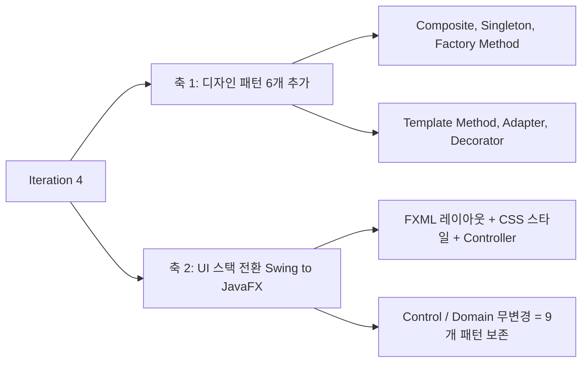
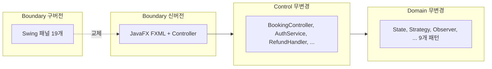
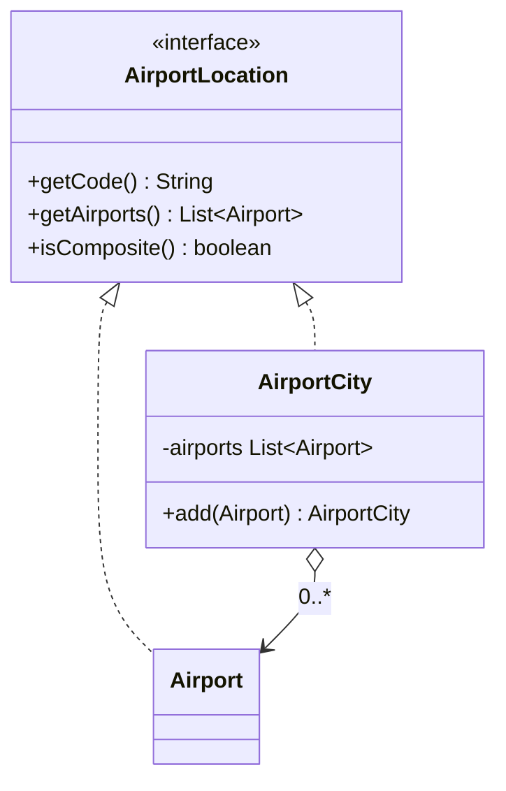
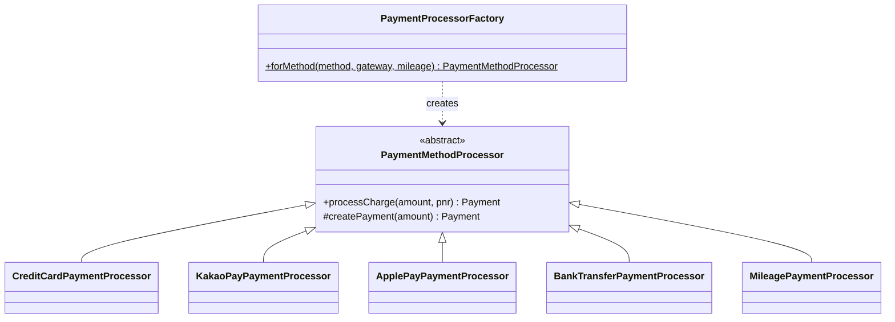
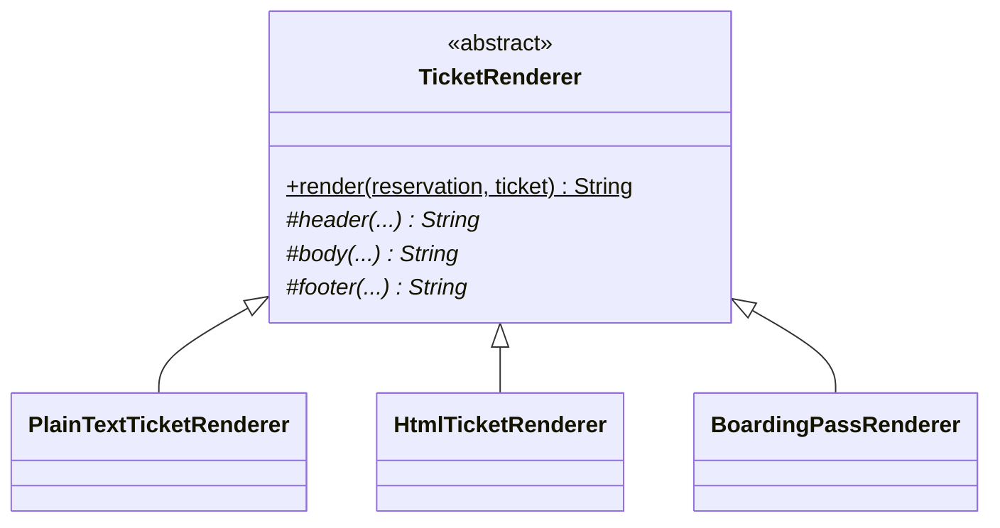
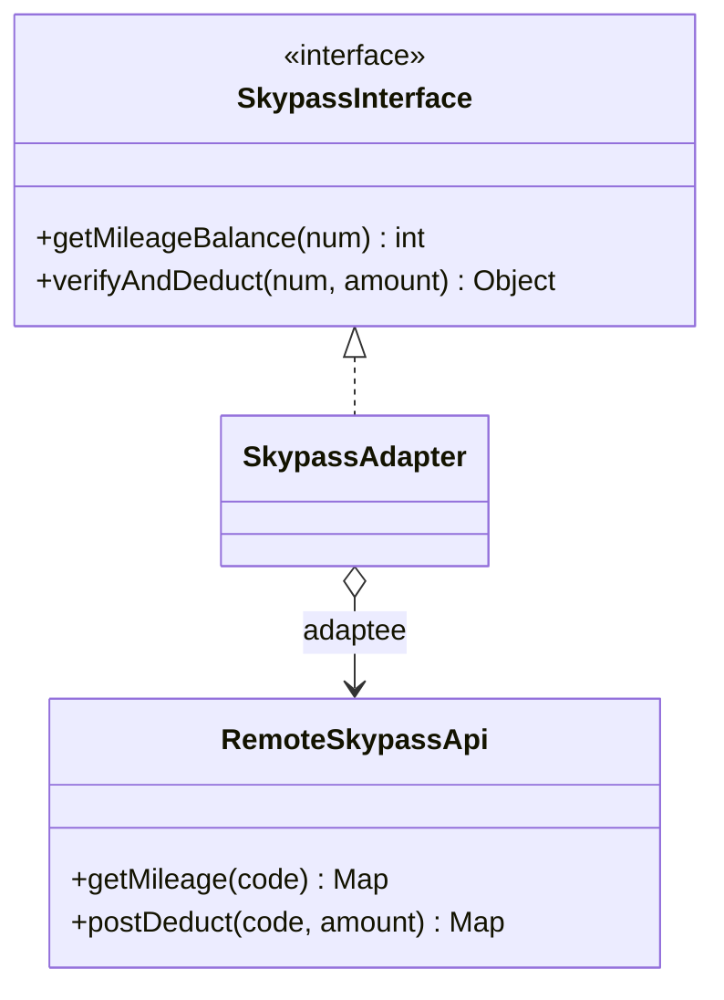
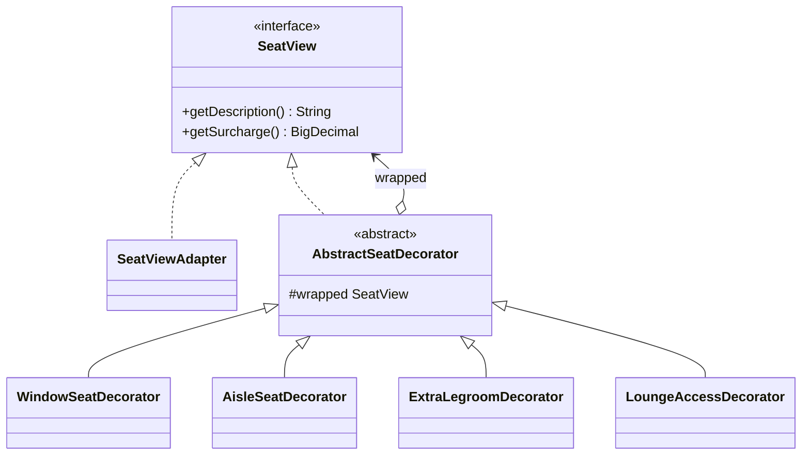
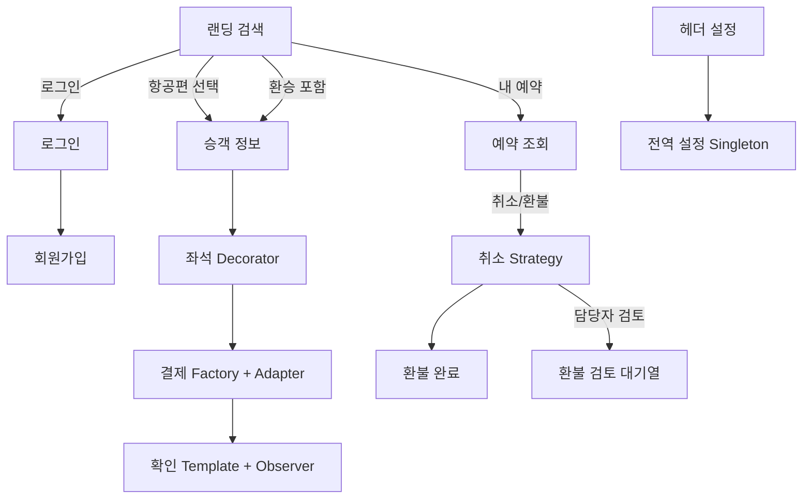

<div align="center">

# ✈️ Iteration 4 — 6개 패턴 추가와 JavaFX UI 전환

### 대한항공 Skypass 티켓 예약 시스템

[](https://github.com/gimjungwook/KoreanAirReservationDomain)
[](#-1-iteration-4-범위)
[](#-3-디자인-패턴-인벤토리-9개)
[](#-2-핵심-결정-swing에서-javafx로)

[**⬅ Iteration 3 (Observer)**](iteration-3-ko.md), [**📂 Source code**](https://github.com/gimjungwook/KoreanAirReservationDomain)

</div>

> [!IMPORTANT]
> ### 📣 Iteration 3 에서 Iteration 4 로
> Iteration 3까지 State, Strategy, Observer 세 패턴으로 예약의 전 생애주기와 비동기 이벤트 전파를 완성했다. Iteration 4는 두 축으로 마무리한다.
> 1. **디자인 패턴 6개 추가** (Composite, Singleton, Factory Method, Template Method, Adapter, Decorator). 이로써 GoF 패턴이 총 9개가 되고, 9개 모두 UI 화면에서 실제로 호출되어 동작한다.
> 2. **UI 스택 전환**: Swing 을 폐기하고 JavaFX(FXML + CSS + MVC)로 Boundary 전체를 교체했다. Control 과 Domain 은 한 줄도 바꾸지 않았다.

### 🗺 발표 흐름

| 순서 | 내용 | 절 |
| :-: | --- | :-: |
| 1 | Iteration 4 범위 두 축 | 1 |
| 2 | UI 스택 전환 결정과 ECB 비파괴 경계 교체 | 2 |
| 3 | 디자인 패턴 9개 인벤토리 (도입 시점, UI 시연 위치) | 3 |
| 4 | 신규 6개 패턴의 도입 동기와 구조 | 4 |
| 5 | 화면 구성과 예약 흐름 | 5 |
| 6 | 핵심 시연 시나리오 | 6 |
| 7 | 품질 보증 (AI 코드리뷰, 컴파일, FXML, 수동 QA) | 7 |
| 8 | 의도적 한계와 결론 | 8 |

---

## 📌 0. 실행 방법

JavaFX 의존성은 Maven 이 자동으로 내려받는다. Maven Wrapper(`mvnw`)가 포함되어 별도 설치가 필요 없다.

```bash
cd KoreanAirReservationDomain
./mvnw javafx:run          # macOS / Linux
mvnw.cmd javafx:run        # Windows
```

진입점은 `com.koreanair.reservation.app.fx.FxApp`. 콘솔 드라이버(`app.App`)도 그대로 동작한다. `tools/`(AmaterasUML 에미터)는 Eclipse 플러그인 jar 의존이라 Maven 빌드에서 제외된다.

---

## 📌 1. Iteration 4 범위

Iteration 4는 서로 독립적인 두 축으로 구성된다.



핵심 목표는 단순히 패턴 수를 늘리는 것이 아니라, **이미 도메인에 구현되어 있던 능력을 사용자 화면에서 실제로 동작시키는 것**이었다. Iteration 3까지의 UI(Swing)는 핵심 예약 흐름만 노출했고, 결제 수단 선택, 좌석 부가옵션, 전자항공권 렌더, 마일리지 결제, 환승 검색, 전역 설정 같은 백엔드 기능은 화면에서 도달할 수 없었다. Iteration 4는 이 간극을 메우면서 자연스럽게 6개의 새 패턴을 끌어들인다.

---

## 📌 2. 핵심 결정: Swing 에서 JavaFX 로

### 2.1 동기

Swing UI 는 레이아웃을 명령형 코드(GridBagLayout 의 제약 계산, 좌표 산술)로 작성한다. 화면을 반복 개선할수록 이 imperative 레이아웃 코드가 비대해지고, 스타일과 로직이 한 클래스에 뒤섞였다. JavaFX 는 레이아웃을 **선언형 FXML**(XML 트리)로, 스타일을 **CSS**로 분리하고, 로직은 **Controller**가 담당한다. 즉 같은 화면을 더 적은 코드로, 관심사를 분리해 표현할 수 있다.

### 2.2 ECB 관점에서의 정당성

이 전환의 핵심 논점은 **Boundary 만 교체했고 Control 과 Domain 은 전혀 건드리지 않았다**는 것이다. 이는 ECB(Entity-Control-Boundary) 아키텍처가 주장하는 "경계 교체의 비파괴성"을 코드로 재증명한다.



구 `app.swing` 패키지 19개 파일을 삭제하고, 새 `app.fx` 패키지를 추가했다. 9개 디자인 패턴은 모두 Control 과 Domain 계층에 살아 있으므로 전환의 영향을 받지 않았다.

### 2.3 JavaFX 구조 (MVC)

| 구성요소 | 역할 |
| --- | --- |
| `FxApp` | JavaFX Application 런처. Control/Domain wiring 은 기존과 동일 |
| `AppContext` | 전 화면이 공유하는 서비스 + 세션 상태 |
| `Navigator` | 화면 전환 단일 진입점 (Swing 의 CardLayout 대체) |
| `ShellController` | 헤더, 단계 표시줄, State 상태 배지 |
| `app.fx.screen.*` | 화면별 Controller (Login, Search, Passenger, Seat, Payment, Confirmation, Lookup, Cancellation, Refund, RefundReview, Settings, Registration) |
| `*.fxml`, `app.css` | 레이아웃과 Korean Air 라이트 테마 |

빌드 도구는 Maven(`pom.xml`)으로 도입했고 `javafx-maven-plugin` 으로 실행한다.

---

## 📌 3. 디자인 패턴 인벤토리 (9개)

본 프로젝트가 적용한 GoF 디자인 패턴은 총 **9개**이며, 9개 모두 JavaFX UI 에서 실제로 호출되어 동작한다.

| # | 패턴 | 분류 | 도입 | 핵심 구현 클래스 | UI 시연 위치 |
| :-: | --- | --- | :-: | --- | --- |
| 1 | **State** | 행위 | iter1 | `ReservationState` + 구상 상태 8개 + `AbstractReservationState` | 헤더 상태 배지 (Initiated → PendingPayment → Confirmed → Ticketed → Refunded 실시간 표시) |
| 2 | **Strategy** | 행위 | iter2 | `RefundPolicy` (Full/Partial/No) | 취소 화면 환불 미리보기, 환불 검토 대기열 |
| 3 | **Observer** | 행위 | iter3 | `TicketPurchasePublisher`, `EventPublisher`, Listener 4개, `DomainEvent` 6개 | e-Ticket 발권 시 셔틀버스 연계 자동 발매 |
| 4 | **Composite** | 구조 | iter4 | `AirportLocation`(Component), `AirportCity`(Composite), `Airport`(Leaf) | 도시 코드(SEL/TYO/NYC/LON) 검색 시 소속 공항 전체 |
| 5 | **Singleton** | 생성 | iter4 | `AppConfig` (double-checked locking) | 설정 화면 글꼴/통화/테마, 즉시 전역 적용 |
| 6 | **Factory Method** | 생성 | iter4 | `PaymentProcessorFactory`, `ItineraryFactory`(Direct/Connecting/MultiCity) | 결제 수단 선택 라우팅, 환승 검색 |
| 7 | **Template Method** | 행위 | iter4 | `TicketRenderer`(final 템플릿) + PlainText/Html/BoardingPass | 확인 화면 e-Ticket 포맷 토글 |
| 8 | **Adapter** | 구조 | iter4 | `SkypassAdapter`(Adapter), `RemoteSkypassApi`(Adaptee), `SkypassInterface`(Target) | 결제 화면 마일리지 잔액 표시, 마일리지 결제 |
| 9 | **Decorator** | 구조 | iter4 | `SeatView`(Component), `AbstractSeatDecorator` + Window/Aisle/ExtraLegroom/Lounge | 좌석 화면 창측/통로 자동 표시, 레그룸/라운지 부가요금 누적 |

분류 분포: 행위 4개, 구조 3개, 생성 2개. 도입 시점: iter1 한 개(State), iter2 한 개(Strategy), iter3 한 개(Observer), iter4 여섯 개.

> Proposal#0 단계의 계획 패턴은 5개(State, Strategy, Observer, Singleton, 옵션 Factory Method)였다. 실제로는 Composite, Template Method, Adapter, Decorator 를 더해 **9개로 계획 대비 4개를 초과 달성**했다.
>
> 보조: 좌석 데코레이터 체인을 조립하는 `SeatViewBuilder` 는 Builder 성격의 헬퍼이지만, 공식 9개 집계에는 포함하지 않는다.

---

## 📌 4. 신규 6개 패턴의 도입 동기와 구조

### 4.1 Composite (구조)

**문제.** "뉴욕행"을 검색하면 JFK, LGA, EWR 세 공항이 모두 후보여야 한다. 그러나 검색 입장에서는 도시 하나든 공항 하나든 동일하게 출발지/도착지로 다루고 싶다.

**해법.** 개별 공항(Leaf)과 공항 묶음인 도시(Composite)를 같은 `AirportLocation` 인터페이스로 다룬다. `getAirports()` 가 Leaf 는 자기 자신을, Composite 는 소속 공항 전체를 돌려준다.



**UI.** 검색에서 도시 코드(SEL, TYO, NYC, LON)를 입력하면 `expand()` 가 `AirportLocation.getAirports()` 로 소속 공항을 펼쳐 검색한다.

### 4.2 Singleton (생성)

**문제.** 글꼴, 표시 통화, 테마 같은 전역 설정은 UI 와 도메인 양쪽에서 같은 값을 봐야 한다. 설정 객체가 여러 곳에서 따로 생성되면 화면마다 값이 어긋난다.

**해법.** `AppConfig` 를 시스템 전체에서 하나로 고정한다. 생성자를 private 으로 막고 double-checked locking 으로 thread-safe 단일 인스턴스를 보장한다. 변경 시 등록된 listener 에 통보한다.

**UI.** 헤더 "설정" 화면에서 글꼴/통화/테마/좌석 메타데이터를 바꾸면 `addChangeListener` 로 등록한 콜백이 즉시 Scene 루트의 글꼴을 다시 적용한다.

### 4.3 Factory Method (생성)

**문제.** 결제 수단(신용카드, 카카오페이, 애플페이, 계좌이체, 마일리지)과 여정 종류(직항, 환승, 다구간)는 각각 다른 객체를 만들어야 한다. 호출자가 직접 `new` 로 분기하면 종류가 늘 때마다 호출자를 수정해야 한다.

**해법.** 생성을 전담 팩토리에 위임한다. 호출자는 추상 타입만 알고, 구체 종류는 팩토리가 고른다.



**UI.** 결제 화면의 결제 수단 콤보가 `BookingController.confirmPaymentWith(...)` 를 통해 `PaymentProcessorFactory.forMethod(...)` 로 실제 ConcreteCreator 를 만든다. 환승 검색은 `ConnectingItineraryFactory` 를 호출한다.

### 4.4 Template Method (행위)

**문제.** 전자항공권을 일반 텍스트, HTML, 탑승권 형식으로 출력한다. 세 출력은 머리말, 본문, 꼬리말이라는 전체 흐름은 같고 각 칸을 채우는 방식만 다르다.

**해법.** 변하지 않는 알고리즘 골격을 상위 클래스의 final 메서드에 고정하고, 달라지는 단계만 하위 클래스가 채운다.



**UI.** 확인 화면에서 포맷을 토글하면 선택한 `TicketRenderer.render(...)` 결과가 영역에 출력된다. 같은 예약 데이터가 머리말 to 본문 to 꼬리말 템플릿을 통해 서로 다른 매체로 찍힌다.

### 4.5 Adapter (구조)

**문제.** 외부 Skypass API(`RemoteSkypassApi`)는 우리 시스템이 기대하는 모양과 다르게 생겼다. 우리 코드가 외부 API 시그니처에 직접 의존하면 외부가 바뀔 때마다 흔들린다.

**해법.** 외부 인터페이스를 우리가 원하는 `SkypassInterface` 로 변환하는 `SkypassAdapter` 를 둔다. 안쪽 코드는 외부 생김새를 몰라도 된다.



**UI.** 결제 화면이 `SkypassInterface.getMileageBalance(...)` 로 마일리지 잔액을 표시하고, 마일리지 결제 시 차감 경로로 흐른다.

### 4.6 Decorator (구조)

**문제.** 좌석에는 창가, 통로, 넓은 레그룸, 라운지 이용 같은 부가 속성이 조합으로 붙는다. 모든 조합마다 클래스를 만들면 폭발한다.

**해법.** 기본 좌석을 감싸는 장식을 겹겹이 쌓아 라벨과 추가 요금, 부가 서비스를 누적한다. 조합은 런타임에 체인으로 조립된다.



**UI.** 좌석 화면에서 좌석을 고르면 위치(창측/통로)에 따라 데코레이터가 자동으로 붙고, 레그룸/라운지 체크박스로 데코레이터를 추가로 덧씌운다. 누적된 부가요금(`getSurcharge()`)이 결제 총액에 합산된다.

---

## 📌 5. 화면 구성과 예약 흐름



검색은 편도, 왕복, 다구간 세 모드를 지원한다. 왕복은 가는 편을 고른 뒤 오는 편을 고르고, 다구간은 구간 행을 추가하며 구간별로 항공편을 선택한다. 비회원도 로그인 없이 예약을 진행할 수 있으며, 로그인은 회원 정보 자동 채움과 예약 목록 조회를 위한 선택 사항이다.

---

## 📌 6. 핵심 시연 시나리오

1. **비회원 예매 end-to-end**: 인기 여행지 카드(도쿄) 선택 to 항공편 선택 to 승객 정보 to 좌석 선택 to 결제 to 확인. 헤더의 State 배지가 PendingPayment to Confirmed to Ticketed 로 전이한다.
2. **Decorator 가 결제에 반영**: 좌석에 레그룸을 더하면 부가요금 50,000원이 결제 총액(320,000 + 세금 32,000 + 50,000 = 402,000)에 합산된다.
3. **Factory Method 결제 라우팅**: 결제 수단을 바꾸면 해당 ConcreteCreator 로 결제가 처리된다.
4. **Template Method 전자항공권**: 발권 후 포맷을 일반 텍스트와 보딩패스로 토글하면 동일 데이터가 다른 형식으로 렌더된다.
5. **Singleton 전역 설정**: 설정에서 글꼴 크기를 바꾸면 모든 화면이 즉시 다시 그려진다.
6. **Observer 셔틀 연계**: 확인 화면에서 셔틀 도시를 고르면 e-Ticket 발권을 신호로 버스티켓이 자동 발매된다.

---

## 📌 7. 품질 보증

- **AI 코드리뷰 (codex exec, read-only)**: 5회 반복 검토. HIGH 5건, MED 4건을 발견하고 모두 수정했다(이중 환불, 하드코딩 운임, 비활성 ConnectingFactory, Skypass 번호 미증가, 잘못된 상태 전이, 환불 상태 기계 등). 최종 결과 "HIGH 잔여 없음".
- **컴파일**: Maven clean compile 무오류(146개 클래스).
- **FXML 검증**: 13개 FXML 전부 런타임 로드 성공(fx:id, onAction 바인딩 정상).
- **수동 QA**: 실제 앱 구동 후 예약 전 과정을 클릭으로 검증. State, Decorator, Factory, Template Method, Singleton 의 동작을 화면에서 직접 확인했다.

---

## 📌 8. 의도적 한계와 결론

### 8.1 한계 (의도적)

- **관리자 콘솔 미구현**: `authenticateAdmin`, `changeFlightStatus`, `createSchedule` 은 백엔드에서 빈 stub 이므로 화면을 만들지 않았다(동작하지 않는 버튼 방지).
- **다인/좌석등급 미지원**: 예약 흐름은 성인 1명, 일반석 기준이다. 검색의 승객/좌석 선택은 이 기준만 노출한다.
- **좌석-티켓 연결**: 좌석은 인벤토리에 배정되지만 전자항공권 본문에는 좌석 번호가 채워지지 않는다(도메인의 기존 한계).
- **통화/테마 부분 적용**: 설정의 글꼴은 즉시 전역 반영되나 통화 포맷과 테마 클래스 적용은 일부에 한정된다.

### 8.2 결론

Iteration 4는 도메인에 잠재해 있던 능력을 사용자 화면으로 끌어올리면서 GoF 패턴을 9개로 늘렸고, 9개 모두 UI 에서 실제로 동작한다. UI 스택을 Swing 에서 JavaFX 로 전면 교체하면서 Control 과 Domain 을 한 줄도 바꾸지 않은 점은, ECB 아키텍처의 경계 교체 비파괴성을 실증한다. 계획했던 5개를 넘어 9개를 달성하여 패턴의 종류와 적용 맥락 모두에서 과목의 학습 목표를 충족한다.

<div align="center">
<sub>ECE312 객체지향 설계패턴, 한동대학교 2026년 1학기, A팀 (김정욱, 이재호, 김경동)</sub>
</div>
